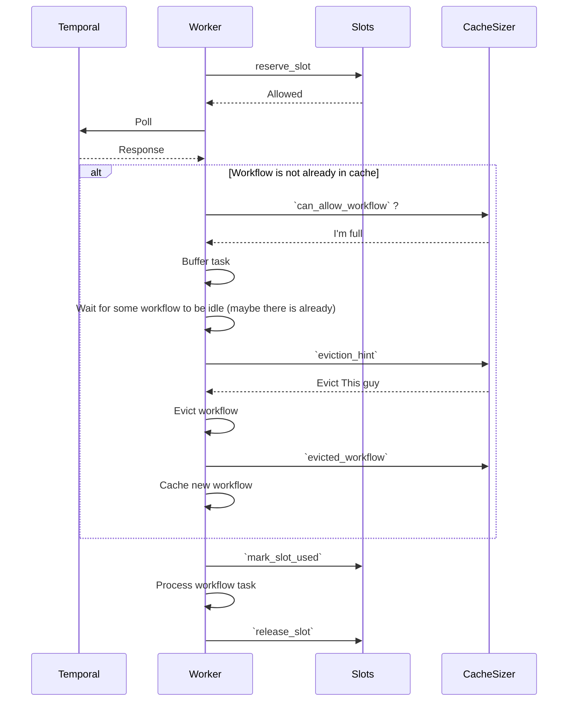

# Worker Autotuning Proposal

Users often struggle with the appropriate configuration of workers. There are many options to fiddle with, nearly none
of which are something users should be required to think about. This proposal aims to reduce the cognitive load of
configuring workers by automatically tuning various worker internals at runtime without (or with configurable) user
intervention.

Specifically here we are focusing on the first steps architecturally to enable the automatic tuning of an *individual*
worker. Questions of how to scale up/down the total number of workers are not part of the scope of the proposal, but
I make some reference towards how this effort could assist that one in the future. We're also not aiming to
automatically detect or resolve all possible kinds of bottlenecks a user might encounter.

We are aiming to:
* Give users the option of a better out-of-the-box experience that allows workers to maximize (or at least get closer to
  maximizing) their resource usage on an individual basis without manual load testing and configuration. Thereby
  reducing user ramp-up time and our support burden.
* Establish architecture that allows us (or users) to build more advanced autotuning features in the future

## Definitions and context
* **Poller** or **poller routine**: A thread/goroutine/tokio task/etc that is responsible for polling for tasks of a
  particular type. Namely a [sticky] workflow task poller or an activity task poller.
* **Slot**: A permit or the right to execute a task of a particular type. Workflow, activity, or local activity. The
  total number of slots that exist at any moment for a task type represents the maximum number of tasks of that type that
  can be executed in parallel. Currently our SDKs use a fixed ceiling for this number per task type.
* **In use slot**: Pollers need to reserve a slot before proceeding to make the actual RPC call. Once the call has
  returned a valid task, the slot is marked as in use. This distinction matters largely for metrics reporting reasons -
  a user would typically not think of a slot reserved by a poller but without a task yet as "in use".


## Areas of configuration
There are a few different configuration areas that we can autotune:

### Concurrent Pollers
Right now the number of pollers used for polling workflow and activity tasks is fixed to a maximum defined by the user.
In Core: `max_concurrent_wft_polls` and `max_concurrent_at_polls`. There's no need for this number to be fixed, and we
can and should scale it up and down as demand dictates.  This work is largely already designed and implemented in Go:
[see the branch
here](https://github.com/temporalio/sdk-go/compare/master...Quinn-With-Two-Ns:sdk-go:poller-autottune-v0.2). Hence this
doc will not focus on this area in detail.

It is important to note that there is a distinction between the active number of poller *routines* and the active number
of *open actual RPC calls*. The number of routines may be scaled independently of the number of open RPC calls at any
time. The former may have a floor, whereas the latter must always be able to go to 0. Users are unlikely to care about
the number of routines as they are relatively cheap. They *do*, however, care about how quickly we will change the
number of active RPCs. The floor on the number of routines effectively determines how quickly we are willing to consume
available slots and thus make actual RPC calls. IE: If the floor on the number of routines is 10, and 10 slots open up
at the same time, we will immediately make 10 RPC calls. 

In Go the name for these options is already misleading: `MaxConcurrentWorkflowTaskPollers` is not accurate, it's really
`NumWorkflowTaskPollers` (or routines), what it probably should be is `MaxConcurrentWorkflowTaskPolls`, since the number
of open RPC calls is actually what's fluctuating.


### Slot tuning & Cache Size

Workers have a configurable number of slots for task types. In Core: `max_outstanding_workflow_tasks`,
`max_outstanding_activities`, and `max_outstanding_local_activities`. These are set by the user and can't change at
runtime. Autotuning of these values seeks to allow them to change at runtime according to available resources on
the worker. It is not feasible for us to choose *optimal* values for these at runtime, because we cannot know a-priori
about how much resources any given workflow or activity task will consume - only the user can (maybe) know this.
However, we can provide reasonable default autotuning implementations while also allowing users to provide their own.

Additionally, there is a maximum cache size for cached workflows. In Core: `max_cached_workflows`. This is also set by
users at the moment, and autotuning it is subject to the same lack of knowledge we have as with slot tuning.

## Constraints

There are some invariants that must be maintained:

* The current number of active polls for a task type must be <= the number of free slots (in use or not) for that task
  type at all times. Otherwise, we can end up receiving a task that won't have anywhere to go until a slot frees. For
  example, in Core this is expressed by using a permit reservation system.
* Max outstanding workflow tasks must be <= max cached workflows.

## Proposed interface for slot management

To reiterate, we can't possibly know as well as the user what resources a given workflow or activity task will consume.
Thus, we need to provide an interface by which users can tell us whether they think it's reasonable to allow the use
of an additional slot.

The interface definition here is provided in Rust, but need not be copied exactly by other languages. Since users are
implementing it, we want something idiomatic for them. Rust will likely immediately convert all newly allowed slots into
a permit struct which will automatically release the slot when dropped (like it does today, without this interface). 
Languages with destructor semantics should do the same, as permit/slot leaking is easy to do by accident.

There is some mild generic magic going on to represent different types of slots and constrain that the right info type
is provided. These guarantees can't be compile-time enforced across the language boundary, but are at least useful after
runtime validation.

```rust
trait SlotSupplier {
  type SlotKind: SlotKind;
  /// Blocks until a slot is available. In languages with explicit cancel mechanisms, this should be cancellable and
  /// return an option indicating whether a slot was actually obtained or not. In Rust, the future can simply be dropped
  /// if the reservation is no longer desired.
  async fn reserve_slot(&self, ctx: &dyn SlotReservationContext<Self::SlotKind>) -> SlotPermit;

  /// Tries to immediately reserve a slot, returning one if a slot is available.
  ///
  /// This version of reservation is used for the acquisition of slots for eager activities and eager workflow start, 
  /// both of which are latency optimizations. Implementations which do not feel they can provide a reasonable answer 
  /// without blocking can always return false. Alternatively, implementations may feel free to perform blocking work in
  /// the background so that they can "pre-prepare" an answer for calls to this method.
  fn try_reserve_slot(&self, ctx: &dyn SlotReservationContext<Self::SlotKind>) -> Option<SlotPermit>;

  /// Marks a slot as actually now being used. This is separate from reserving one because the pollers need to
  /// reserve a slot before they have actually obtained work from server. Once that task is obtained (and validated)
  /// then the slot can actually be used to work on the task.
  /// 
  /// Users' implementation of this can choose to emit metrics, or otherwise leverage the information provided by the
  /// `info` parameter to be better able to make future decisions about whether a slot should be handed out.
  /// 
  /// This implementation must be non-blocking.
  fn mark_slot_used(&self, info: <Self::SlotKind as SlotKind>::Info<'_>, permit: &SlotPermit);

  /// Frees a slot. This is always called when a slot is no longer needed, even if it was never marked as used.
  /// EX: If the poller reserves a slot, and then receives an invalid task from the server for whatever reason, this
  /// method would be called with [SlotReleaseReason::Error].
  /// 
  /// This implementation must be non-blocking.
  fn release_slot(&self, info: SlotReleaseReason, permit: SlotPermit);
}

/// This trait lets implementors obtain other information that might be relevant to their decision on whether to hand
/// out a slot. It's a trait rather than a struct because the most up-to-date information should be available even
/// if waiting for some time in the blocking version of `reserve_slot`.
pub trait SlotReservationContext<SK: SlotKind>: Send + Sync {
  /// Returns the task queue associated with this reservation request.
  fn task_queue(&self) -> &str;
  /// Returns true if this reservation request is for a poll on a sticky workflow task queue.
  fn is_sticky(&self) -> bool;
  /// Returns information about currently in-use slots (TBD if we will have this pending how costly it is)
  fn used_slots(&self) -> &[SK::Info];
  
  // ... anything else users end up wanting here
}

pub struct SlotPermit {
  /// A unique identifier for the slot.
  id: u64,
  /// This is a way for the user to associate some data with the slot they handed out.
  user_data: Option<Box<dyn Any + Send + Sync>>,
}
impl SlotPermit {
  /// We will handle identifier assignment for the user.
  pub fn new(data: Option<Box<dyn Any + Send + Sync>>) -> Self { /* ... */ }
}

pub enum SlotReleaseReason {
  TaskComplete,
  /// The slot was reserved but never actually used. May happen during shutdown.
  NeverUsed,
  Error(anyhow::Error),  // Or possibly something specific to the slot kind, but unlikely.
}

pub struct WorkflowSlotInfo<'a> {
  pub workflow_type: &'a str,
  // etc...
}

pub struct ActivitySlotInfo<'a> {
  pub activity_type: &'a str,
  // etc...
}
pub struct LocalActivitySlotInfo<'a> {
  pub activity_type: &'a str,
  // etc...
}

struct WorkflowSlotKind {}
struct ActivitySlotKind {}
struct LocalActivitySlotKind {}
pub trait SlotKind {
  type Info<'a>;
}
impl SlotKind for WorkflowSlotKind {
  type Info<'a> = WorkflowSlotInfo<'a>;
}
impl SlotKind for ActivitySlotKind {
  type Info<'a> = ActivitySlotInfo<'a>;
}
impl SlotKind for LocalActivitySlotKind {
  type Info<'a> = LocalActivitySlotInfo<'a>;
}

/// Users might want to be able to pause the handing-out of slots as an effective way of pausing their workers.
/// We can provide an implementation for this that wraps their implementation, or one of the defaults we provide.
/// 
/// Pausing a supplier should cause any call to `reserve_slot` to block until `resume` is called. Internally, if the
/// pause happened during a call to the inner supplier, and that call resolves while paused, the slot should be 
/// released back to the inner supplier. At least one user expressed a desire for the semantics to be "definitely do not
/// do any new work when paused". This means that, if we handed out a slot, then paused, and then a poll call resolved
/// we would end up doing "new work" while paused. We may support that use case in the future by adding an option to
/// `PauseOptions` that could cancel any outstanding poll calls who already reserved a slot.
struct PauseableSlotSupplier<T: SlotKind> {
  inner: Arc<dyn SlotSupplier<SlotKind=T>>,
  paused: AtomicBool,
  // ... details
}
impl<T: SlotKind> PauseableSlotSupplier<T> {
  pub fn new(supplier: impl SlotSupplier<SlotKind=T>) -> Self { /* ... */ }
  pub fn pause(&self, options: PauseOptions) { /* ... */ }
  pub fn resume(&self) { /* ... */ }
}
impl<T: SlotKind> SlotSupplier for PauseableSlotSupplier<T> {
  // ... implementation which checks the paused flag before handing out a slot
}
```

## Workflow cache management

The workflow cache is maintained independently of the number of slots in use. There could be 0 slots in use and 100
workflows cached, and that's a totally normal scenario. We might also choose to make this user-configurable, though we
certainly don't need to have that right out of the gate.

Keeping our fixed-size implementation to start is fine, because we won't ask the user's slot provider for a slot unless
there is room in the cache (either additional capacity, or an idle cached workflow that can be evicted). This avoids
a potential problem where we ask for a slot, they provide one, but there's nothing we can evict at the moment.

If and when we do introduce user-configurable caching, it's likely that they would want the same thing to be responsible
for both slots and cache management, since the two are closely related.

A possible future:

```rust
trait WorkflowCacheSizer {
  /// Return true if it is acceptable to cache a new workflow. Information about already-in-use slots, and just-received
  /// task is provided. Will not be called for an already-cached workflow who is receiving a new task.
  /// 
  /// Because the number of available slots must be <= the number of workflows cached, if this returns false
  /// when there are no idle workflows in the cache (IE: All other outstanding slots are in use), we will buffer the
  /// task and wait for another to complete so we can evict it and make room for the new one.
  fn can_allow_workflow(&self, slots_info: &WorkflowSlotsInfo, new_task: &WorkflowSlotInfo) -> bool;
  
  // ======================= Methods in this box might be added in a future date, but not initially ====================
  
  /// Called when deciding what workflow should be evicted from the cache. May return the run id of a workflow to evict.
  /// If None, or an invalid run id is returned, the default LRU eviction / strategy is used. The id returned must
  /// be one of the workflows provided in `evictable` (the ones for which there is no actively processing WFT).
  fn eviction_hint(&self, evictable: &[WorkflowSlotInfo]) -> Option<&str>;
  /// Called when a workflow is evicted from the cache
  fn evicted_workflow(&self, evicted: &WorkflowSlotInfo);
  
  // ===================================================================================================================
}

/// The user would be allowed to provide either just a slot supplier (using the standard fixed-size cache),
/// or one of these to handle both themselves.
/// 
/// I'm a bit at a loss for a good name
trait WorkflowSlotAndCacheManager: WorkflowTaskSlotSupplier + WorkflowCacheSizer {}

struct WorkflowSlotsInfo {
  used_slots: Vec<WorkflowSlotInfo>,
  /// Current size of the workflow cache.
  num_cached_workflows: usize,
  /// The limit on the size of the cache, if any. This is important for users to know as discussed below in the section
  /// on workflow cache management.
  max_cache_size: Option<usize>,
  // ... Possibly also metric information
}
```

## Flow

Some context on the current flow (at least in Core). The cache only applies to workflow tasks. This flow should remain
the same after these changes. The flow makes it clear that a misbehaving `WorkflowSlotAndCacheManager` which allows lots
of slots but keeps saying the cache should not expand could result in buffering tasks and generally gumming things
up.



## Default implementations

We should provide a few default implementations:

* Fixed-size SlotSupplier: This is the current implementation. There's a fixed number of slots, that's it.
* Resource based SlotSupplier: This implementation can look at how close the worker is to some resource limit
  (% of CPU and/or memory used), and hand out slots if it's still below that limit. This only makes sense for
  activity slot suppliers, since workflows use little CPU, and the memory they use is the concern of cache
  management, not the slot supplier.
* Memory based WorkflowCacheSizer: Like above, but for the sizing of the workflow cache.

## Metrics

Users can add their own metrics behind their implementations now, which is great - but we can also provide some out of
the box. We can always provide `slots_in_use` by type. Right now we emit the inverse of this,
`worker_task_slots_available` - we can keep emitting that with a bundled implementation that replicates the old
fixed-number based implementation. 

We can also of course keep emitting the current number of cached workflows.


## Where it hooks up and the language barrier

Staying in Rust for a moment, the slot supplier implementations can be hooked up on a per-worker basis through
`WorkerConfig`, as expected. We would add:

```rust
pub struct WorkerConfig {
  // ... existing fields
  #[builder(default)]
  pub workflow_task_slot_and_cache: Option<Arc<dyn WorkflowSlotAndCacheManager>>,
  #[builder(default)]
  pub activity_task_slot_supplier: Option<Arc<dyn ActivityTaskSlotSupplier>>,
  #[builder(default)]
  pub local_activity_task_slot_supplier: Option<Arc<dyn LocalActivityTaskSlotSupplier>>,
}

impl WorkerConfig {
  /// Set the slot supplier for workflow tasks, using the default fixed-size workflow cache
  pub fn with_workflow_slot_supplier(&mut self, supplier: impl WorkflowTaskSlotSupplier) -> &mut Self { /* ... */ }
}
```

This is analogous to what we'd expect in the worker config for other languages.

The suppliers are kept inside of `Arc`s so that they can be shared across multiple workers, and used with the pauseable
supplier (which the user presumably wants to retain a reference to so they can call pause).

Of course, most users aren't going to be implementing this in Rust, they'll be doing it in their language, and then
we've got to translate that into calls across the language barrier. As such we need a slot provider implementation
that exists in each language's bridge, and calls callbacks into the user's implementation.

Something like:

```rust
pub struct RustToLangBridgeSlotSupplier {
  // ... store callbacks etc
}

impl<T: SlotKind> SlotSupplier<SlotKind=T> for RustToLangBridgeSlotSupplier {
  // ... call appropriate callbacks, convert data types, etc
}
```

## A neat example

For fun, here's a neat example of some of the complex stuff you could get up to with a custom slot supplier.

Say you have some activity workers who all interact with an external service. There are two types of activities that
interact with the service, one of which can have many instances run in parallel, and another that should prevent any
new work from being done until it's finished.

You can implement a slot supplier for these workers that coordinates their efforts! Pseudocode below. This toy
isn't meant to be taken seriously and is likely prone to a race, but it shows that cross-worker coordination is possible
and also raises some questions (see later section for more on that).

```rust
struct MyCoordinatingSlotSupplier {
  lock_svc_client: LockServiceClient,
  per_worker_allowed: Sempahore,
}

impl ActivityTaskSlotSupplier for MyCoordinatingSlotSupplier {
  async fn reserve_slot(&self) -> Result<(), anyhow::Error> {
    self.lock_svc_client.wait_for_lock_not_held_or_being_acquired().await?;
    self.per_worker_allowed.acquire().await?;
    Ok(())
  }
  
  fn try_reserve_slot(&self) -> Result<bool, anyhow::Error> { /* ... */ }
  
  fn mark_slot_used(&self, info: &ActivitySlotInfo) {
    if info.activity_type == "there_can_only_be_one" {
      // Probably kicks off something in the background, but immediately blocks slot reservation
      self.lock_svc_client.eventually_acquire_lock();
    }
  }
  
  fn release_slot(&self, info: &ActivitySlotInfo) {
    if info.activity_type == "there_can_only_be_one" {
      self.lock_svc_client.release_lock();
    }
    self.per_worker_allowed.release();
  }
}
```

## Drawbacks

* Gives users a big footgun. This is mitigated by the fact that most users are probably just going to use one of our
  default implementations. Inevitably though, someone will implement a custom slot supplier or cache manager with buggy
  logic and contact support about it.
* More complexity in the core/lang bridge, nothing too bad though.

## Alternatives

We could not expose this as a user-implementable interface at all and only offer a handful of default implementations.
The benefits of user customization are substantial though, and seem to outweigh the mild complexity increase. Users will
always know more about their workload than we can.

Specifically concerning `mark_slot_used`, we could potentially allow an error to be returned here, causing the SDK to
immediately fail the task instead of working on it. This is maybe a nice way to let users reject tasks they don't want
this worker to handle... however there are some obvious potential thrashing issues there (ex: only one worker rejecting
the same task over and over). Allowing this seems like it'd mostly be a way for users to bandaid over something that was
really a mistake in the way their task queues are architected.

## Adoption & Teaching

We should roll out the feature by introducing the interface & reimplementing the existing behavior behind that
interface. There will be no visible default behavior changes. Likely we'll include some other OOTB implementations like
a memory-based one that users can opt-in to.

We might, at some point, decide that the default implementation should change from the fixed-number-of-slots impl to
a more dynamic one, if we find that it substantially outperforms in most scenarios. If and when we do make that change,
we'll want to give users some advance warning, since although the change is not technically breaking, it could have 
knock-on effects in terms of the external load on the systems their workers are interacting with.

Docs & education will both need content about what the interface is for, what default implementations are provided &
what their limitations are, and how to implement a custom one.

It would also be very valuable to provide tooing & guidance on how to benchmark the performance of a custom (or one of
our) slot supplier implementation. We can fairly easily add to omes the ability to run a scenario where workflows &
activities use a customizable amount of memory/cpu. Users can input values that they feel represent their own activities
and workflow, and then see how the slot supplier implementation behaves under those conditions.

## Open questions

### Async/fallible `mark_slot_used` and `release_slot`
The "fun example" raises questions about whether `mark_slot_used` and `release_slot` should be allowed to be async
and/or return errors. Users might reasonably want to perform side effects in them, but internal usage of these functions
is ideally fast and infallible.

If we were to allow them to be async/blocking, it's another possible spot things can get hosed up and stuck. Less than
great. If we allow them to be fallible, it's not clear what we could do on a returned error besides bubble it up and
shut down the worker.

The downsides seem substantial, and users who want to do this can "offload" the async-ness/fallibility to the
`reserve_slot` function as implied in my toy, which seems reasonable.

## Future considerations

This proposal has focused specifically on worker autotuning and user customization thereof. However, it's worth
considering how this effort will fit in to future work we know we want to do, namely around autoscaling and on-demand
workers.

### Autoscaling

We know we want users to be easily able to spin up, and more importantly know _when_ to spin up, new workers. A good
chunk of this work is already known and has been talked about quite a bit: Having a more accurate task queue backlog
count, creating autoscalers for k8s or other platforms, etc. These autoscalers would likely primarily rely on these
backlog counts, but it makes sense that they (as well as other tooling like alerting facilities, etc) might want to
gather information from workers as well.

For example, there might be a substantial backlog of tasks in the queue while workers are simultaneously not using all
the capacity they could be - this would indicate a problem with the autotuning implementation (or perhaps the need to
turn one on).

As such, we should consider how workers might best expose this information. The obvious answer is probably the best one:
metrics. With this new interface we give users a chance to provide their own metrics around in-worker scaling however
they like. Combined with machine-level metrics like overall cpu/mem usage, scaling tools should be able to get a good
picture of how each worker is behaving.

I do think it's important to state that we don't want to be in the business of generic machine-level health/usage
monitoring. There are bunches of tools that do this already, and any autoscalers we release ought to integrate with the
most common of those tools. Our responsibility it to provide Temporal-specific information needed to make scaling
decisions.