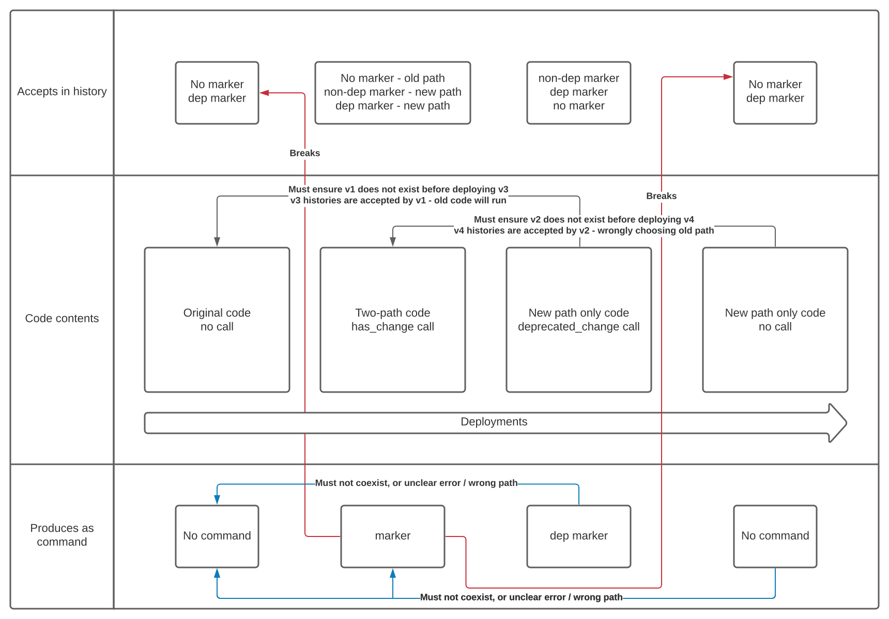

# Workflow versioning 2.0

This proposal introduces two key changes to what is called `getVersion` in the existing SDKs, but will likely be renamed in subsequent ones (more on naming later). The key changes are:

* Introduce a different API for versioning that does not involve a version range, but instead simply returns a boolean indicating if a named change has happened or not. Ex: `hasChange("change-id")`. TBD if we would eliminate the range-based API, or leave it for advanced users.
* It will no longer be valid to replay a workflow history containing a (non-deprecated, more on that later) version marker against code which does not have a corresponding call to the version API.

## Boolean-only API and Renaming
The existing `getVersion` API is confusing to users. What's a default version? What should the maximum be? Why is it always returned by workflows that have hit that line for the first time?

If it's the case that very few users ever actually need version ranges, which seems likely, then a much simpler API can be presented. In fact, it's still possible to conceptually represent version ranges with it as well, if needed.

Instead of `get_version("change-id", minver, maxver) -> number`, consider: `changed("change-id") -> bool`

If the workflow code is executing for the first time, it will write a marker into history meaning "change change-id happened". If it is replaying history, it will verify such a marker exists and return true. If the marker does not exist, it will return false. Versions of the code without the call will fail (more on that in other section).

Version ranges can still be simulated if needed like:
```rust
if changed("change-ver-2") {
    // blah
} else if changed("change-ver-1") {
    // blah
}
// etc
```

This seems dramatically more understandable at the cost of making a probably not very common scenario mildly more verbose.

## Enforcing the presence of version API calls/commands in the presence of version markers (2-phase deprecation)
To expand on why the second change is important. Imagine the below two versions of the same (imaginary, Rust) workflow code:

```rust
// Original version (v1)
fn workflow() {
   // ...previous code....
   activity_a().await;
   activity_must_run_after_a().await;
}
```

```rust
// Version 2
fn workflow() {
   // ...previous code....
   if changed("change_id") {
       activity_b().await;
   } else {
       activity_a().await;
       activity_must_run_after_a().await;
   }
}
```

Imagine that a run of the workflow begins executing on a worker with version 2. It hits the `get_version` call and writes the marker, and then dies. Then, a worker running the original code picks up that history. It will execute the `a` activities, but it should not have, it was already known that this workflow history should take path B.

With this change, the workflow task would fail because the worker's code does not have a `get_version` call, but there was a version marker in the history.

This has the effect that users now must take a 2-phase approach to deprecating old code, but in exchange are given better guarantees around workflow state consistency. If the user wants to remove path A, they can change their code to:

```rust
// Version 3
fn workflow() {
   // ...previous code....
   must_have_change("change_id")
   activity_b().await;
}
```

This code accepts any sort of history (which means there must be *no* v1 workers left when it is deployed, as they may have already ran the old code and will not have written a marker). It *always* writes a marker into history with a special "deprecated" flag. The v2 code accepts this in history and chooses the new path, so v2 and v3 may coexist. This version accepts no marker as well, because otherwise it would be impossible to deploy v4 code below.

```rust
// Version 4
fn workflow() {
   // ...previous code....
   activity_b().await;
}
```

v4 now no longer writes any markers into history. It *does* accept histories with a "deprecated" marker, so that it may coexist with v3. It must *not* coexist with v2 workers, as it would cause them to choose the old path.


### Visualized


