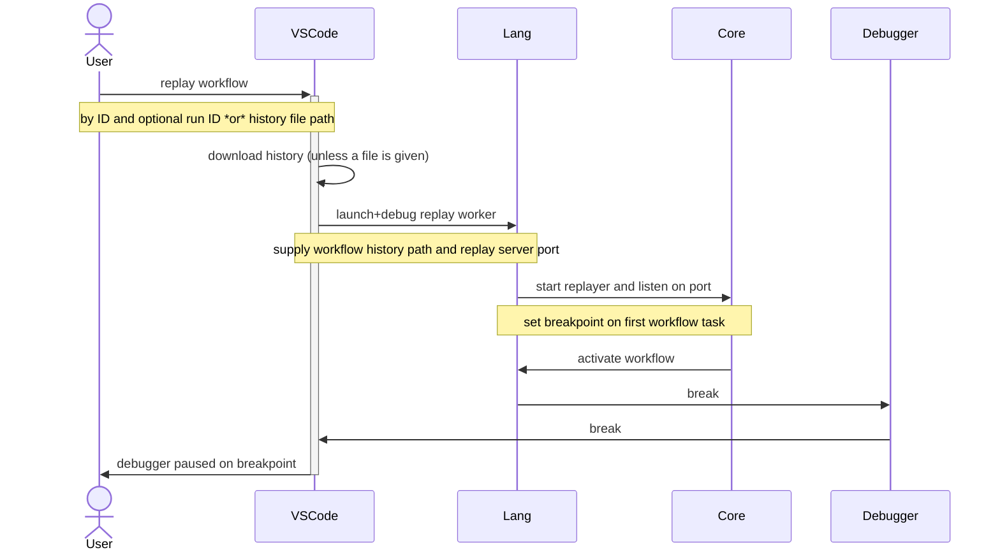
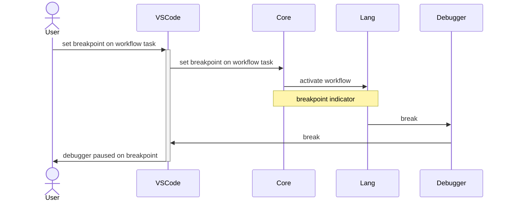

# Debugger proposal

## Background

One of the greatest advantages of being a log based workflow engine is that Temporal workflows are replayable.

A developer can download workflow history and run it through the SDK replayer to materialize the workflow program's
state.

Workflows, being "just code", can be debugged with tools the developer is familiar with.

## Features

### Overview

Typically, when looking at workflow history, it's clear which workflow task a failure occurs in but it's not immediately
obvious which line of code that correlates to.

This proposal discusses how we can make the debugging experience better for developers.

### Supported languages

Initially we will support Core based languages (TypeScript and Python) but Go and Java could also be supported with
additional effort.

The main advantage of going for Core based languages is that those language SDKs run Rust Core in a separate thread
pool, allowing interaction with the runtime while a workflow is paused by a debugger.

Targeting Core based SDKs will allow us to reuse a lot of the code for Ruby, .NET and possibly other SDKs if we decide
to rewrite them to be backed by Core.

### Supported IDEs

Initially we will support Microsoft's Visual Studio Code only while keeping in mind other IDEs.

The rationale being that at least for JavaScript VSCode is by far the most popular IDE and we'd get the most value
investing in providing good DX for that environment.

### Components

- VSCode plugin
  - Main panel / Workflow history panel
  - Debug adapter
- Core replay debug server
- Lang middleware

#### Main panel

Has input to enter workflow ID and optional run ID with submit button to start a debug session.
Alternatively can have a file (path) input to use a history JSON or binary file (as exported by web and tctl or
downloaded with a client).

The credentials for connecting to a server should be stored in the system keychain (can use
[keytar](https://www.npmjs.com/package/keytar) to manage that).

#### Workflow history panel

Once a debug session has started, the main panel switches to history view.
In this view, the history is displayed in a format with this rough guideline:

```
[ ] Workflow Task
> Event in 1
> Event in 2
< Command out 1
< Command out 2
```

`[ ]` - is a breakpoint toggle

The current workflow task will be highlighed when being processed.

#### Debug adapter

Use to step over SDK code and customized per language

#### Core replay debug server

A webserver opened by Core, listens on port allocated by the VSCode plugin.
Has a single endpoint for setting breakpoints on workflow task started events (by event ID).

In order to indicate to Lang that an activation has a breakpoint associated with it, we'll add a new field to
[`WorkflowActivation`][workflow-activation]

> NOTE: This assumes initial support of Core based languages, could be extended to other languages eventually

#### Lang middleware

Intercepts activations and sets breakpoints

### Worker setup

The IDE plugin shouldn't require writing the boilerplate for setting up the replay worker and should be able to "just
work" with zero setup. That being said, while a typical replay worker setup is more or less standard, the only
meaningful customization options are interceptors, data converters and "sinks" (loggers and such although those
typically do not run during replay).

The IDE plugin should support this customization either by accepting a file for overriding the worker options or by
automatically detecting it given a convention (e.g. `/path/to/project/.temporal-replayer-options.ts` - name TBD).

### History visualization

The POC implementation of this proposal used [Tree View](https://code.visualstudio.com/api/extension-guides/tree-view),
while this provided a native experience, it's quite limited, and my recommendation would be to replace that with a
[Webview](https://code.visualstudio.com/api/extension-guides/webview).

Another advantage we gain by switching to Webview for visualization is the ablity to reuse history visualization across
different IDEs and possibly Temporal web.

The Webview CSS will be customized to match the general VSCode theme.

### Flows

#### Start debug replay session



#### Set breakpoint on workflow task

> NOTE: This assumes it's possible to set a breakpoint directly from language code.
> This assumption works for JS / Python.
> For languages which don't support that, we could make a blocking RPC call to the extension to set a breakpoint
> externally.



[workflow-activation]: https://github.com/temporalio/sdk-core/blob/15ea5d3ee580e2a226eefdcf0d8444b2ae30a997/protos/local/temporal/sdk/core/workflow_activation/workflow_activation.proto#L20
