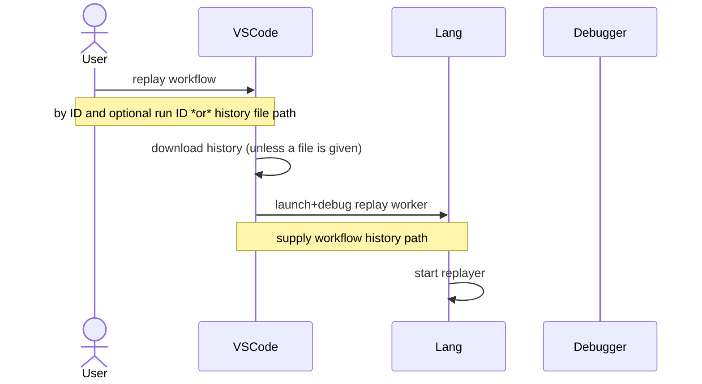
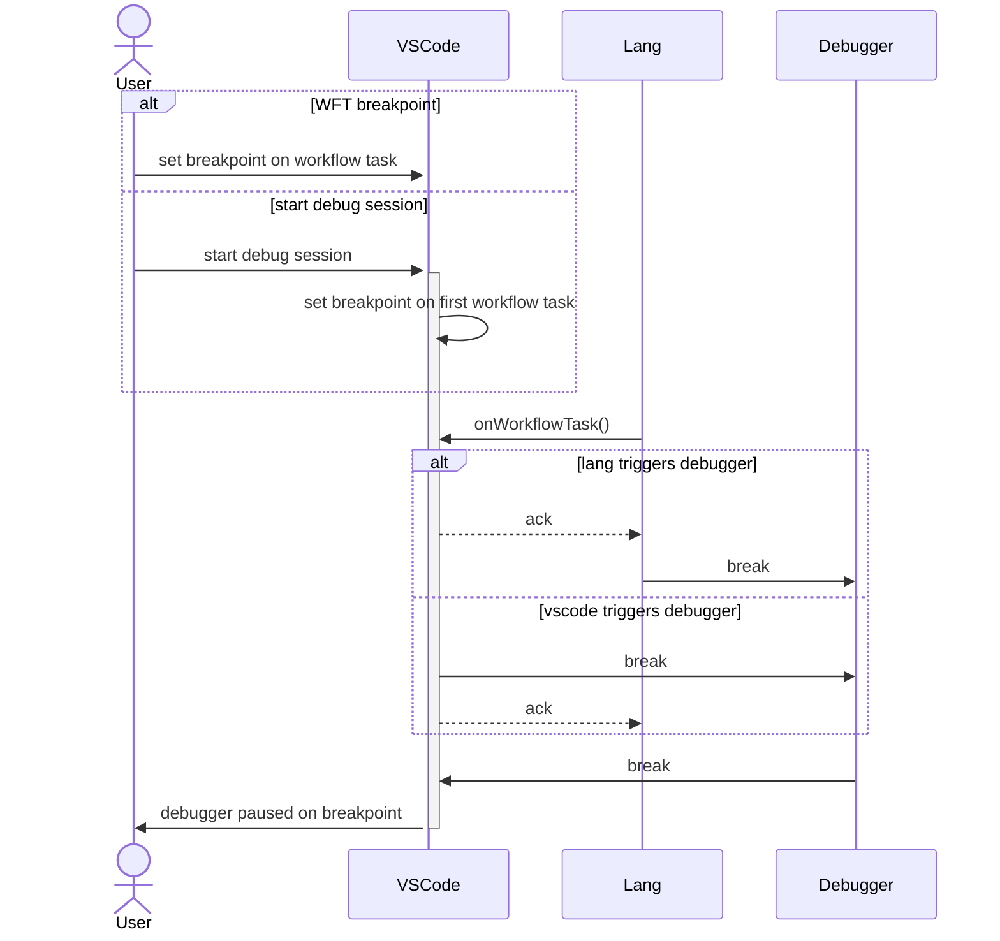

# Debugger proposal

## Background

One of the greatest advantages of being a log based workflow engine is that Temporal workflows are replayable.

A developer can download workflow history and run it through the SDK replayer to materialize the workflow program's
state.

Workflows, being "just code", can be debugged with tools the developer is familiar with.

## Overview

Typically, when looking at workflow history, it's clear which workflow task a failure occurs in but it's not immediately
obvious which line of code that correlates to.

This proposal discusses how to integrate workflow history in IDEs improving the debugging experience and overall
understanding of workflow execution.

## Features

### Supported languages

We will start by supporting TypeScript but other languages could easily be supported with the proposed approach.

### Supported IDEs

Initially we will support Microsoft's Visual Studio Code only while keeping in mind other IDEs.

The rationale being that at least for JavaScript VSCode is by far the most popular IDE and we'd get the most value
investing in providing good DX for that environment.

### Components

- VSCode plugin
  - Main panel / Workflow history panel
  - Debug adapter
  - Workflow state HTTP handler
- Lang middleware

#### Main panel

This panel has 2 main functions:

1. Input to enter a workflow ID and optional run ID with submit button to start a debug session launching a replay
   worker with deadlock detection disabled.
   Alternatively can have a file (path) input to use a history JSON or binary file (as exported by web and tctl or
   downloaded with a client).

2. Input for setting up server credentials.

The credentials for connecting to a server should be stored in [VSCode secrets
storage](https://code.visualstudio.com/api/references/vscode-api#ExtensionContext.secrets).

> NOTE: This panels purpose is to ease launching and configuring replay workers, alternatively a `launch.json` and
> worker program can be used to start a debug session.

#### Workflow history panel

Once a debug session has started, the main panel switches to history view.
In this view, the history is displayed in a format with this rough guideline:

```
[ ] Workflow Task
> Event in 1
> Event in 2
< Command out 1
< Command out 2
```

`[ ]` - is a breakpoint toggle

The current workflow task will be highlighed when being processed.

> NOTE: In order to support setting breakpoints on specific history events in Core based SDKs, the event ID should be
> added to the Core->Lang protocol (ActivationJob).

##### History visualization

The POC implementation of this proposal used [Tree View](https://code.visualstudio.com/api/extension-guides/tree-view),
while this provided a native experience, it's quite limited, and my recommendation would be to replace that with a
[Webview](https://code.visualstudio.com/api/extension-guides/webview).

Another advantage we gain by switching to Webview for visualization is the ablity to reuse history visualization across
different IDEs and possibly Temporal web.

The Webview CSS will be customized to match the general VSCode theme.

#### Debug adapter

Used to step over SDK code - customized per language

#### Workflow state HTTP handler

The VSCode plugin will open a web server and listen for requests from Lang.

Has a single endpoint for receiving state updates from the SDK middleware.

This information is used to highlight the currently processed workflow task.

#### Lang middleware

Intercepts activations and notifies the VSCode plugin of the currently processed workflow task.

Might also need to set breakpoints (`debugger` statement in JS), TBD when we get to the implementation.

> NOTE: Core->Lang protocol does not include the WorkflowTaskStarted event ID, it does include `history_length` which
> represents the same thing, we should consider adding a dedicated field to [`WorkflowActivation`][workflow-activation].

### Worker setup

The minimal replay worker setup requires workflow registration. Advanced options include interceptors, data converters
and "sinks" (loggers and such although those typically do not run during replay).

The IDE plugin should support this customization either by accepting a file path for setting the worker options or by
automatically detecting it given a convention (e.g. `/path/to/project/.temporal-replayer-options.ts` - name TBD).

## Flows

### Start debug replay session



### Set breakpoint on workflow task

Two alternatives are presented here for how the workflow task breakpoint is set.
It might be set directly by VSCode or Lang (supported in languages like JS / Python).



[workflow-activation]: https://github.com/temporalio/sdk-core/blob/15ea5d3ee580e2a226eefdcf0d8444b2ae30a997/protos/local/temporal/sdk/core/workflow_activation/workflow_activation.proto#L20
