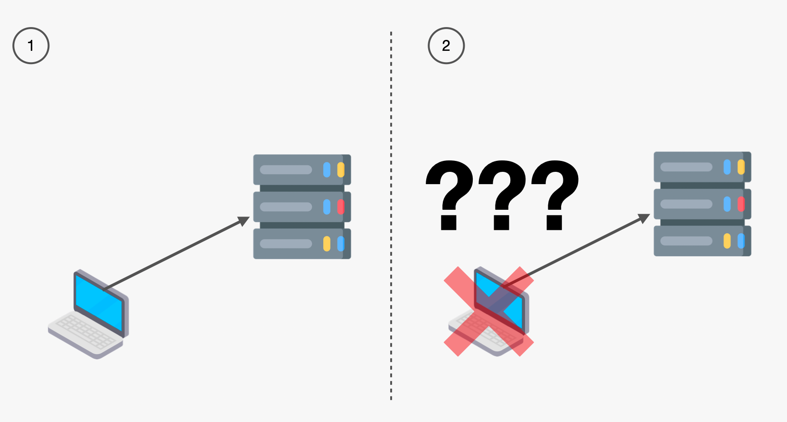
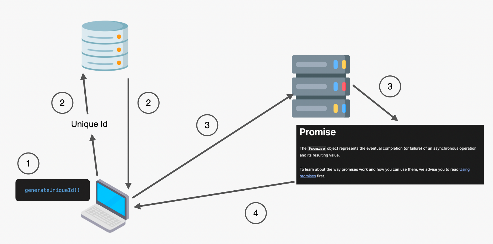

One of the biggest challenges when designing the holistic user experience for the Nexus project is providing the benefits of Workflow calling conventions without leaking the specifics of Workflows. At our first official Nexus offsite, Sergey (one of the earliest Temporal engineers) discussed the analogy between ALOs and the concept of Promises in asynchronous programming. 

I believe this is a very succinct encapsulation which captures the MVP needs for everything we're trying to accomplish. The notion of Durable Promises (server side promises) also give us some serious guidance on what the surface area of ALOs should be.

> 💡 It’s important to note that in the product requirements we made it clear that the ALO solution needs to support multiple methods of delivering results. We described this as “Get Result” above which would likely be an explicit API in most cases. That being said, Get Result as written above is not an API method but rather a general capability. This capability may be satisfied in the form of asynchronous delivery mechanisms (such as webhooks).

You can imagine the minimal Promise inspired ALO API having the following capabilities:

- Start
- Get Result
- Get Status (ie: Rejected, Resolved, Fulfilled)
- Cancellation

The current belief is that ALO should never become a generic Durable Object and therefore it will never be possible to surface arbitrary methods as part of the ALO itself. Instead you would surface those endpoints as either stateless short lived API methods, or as top level ALOs themselves. That being said, there is significant room for extension in the ALO surface area such a Listing & Filtering, and the ability to Pause and Resume.

### Proposal for initial interface of the ALO

```protobuf
// An ALO is started via a
message AloInfo {
  string id = 1;
  Status status = 2;
  map<string, string> metadata = 3;
  repeated string http_result_urls = 4;

  enum Status {
    STATUS_UNSPECIFIED = 0;
    RUNNING = 1;
    COMPLETED = 2;
  }
}

service ALOHandler {
  rpc Start(StartRequest) returns (StartResponse);
  rpc GetInfo(GetInfoRequest) returns (AloInfo);
  rpc GetResult(GetResultRequest) (GetResultResponse);
  rpc Cancel(CancelRequest) returns (CancelRepsonse);
}
```

### A bit about Ids



One of the most common debates around ALOs is whether unique Ids should be a fundamental part of the specification and design. 

Considering ALOs represent the eventual completion of an operation, its impossible to imagine a design where they aren’t identifiable. Note that I did not say “addressable” because technically in the case of asynchronous result delivery it may not be required for the ALO itself to be addressable. That being said, even in the async result delivery case, the result must be delivered with a unique correlation Id. 



Because of this, ALOs will also be required to have a unique Id. Furthermore, because server side generation of unique Ids is inherently lossy, ALO **will be required to be created with a client-side generated unique Id**.

### A non-Temporal example of ALOs

To concretely understand the value of ALOs, it's easiest to showcase how they could be leveraged as part of an HTTP API. The example below will not necessarily be supported initially, and is not using best practices. For instance, the ALOs are all being stored exclusively in memory on a single machine, this means there is no durability and potential race conditions if running multiple servers to handle traffic. 

// TODO (Chad): you may have thoughts on how to improve this

```go
package main

import (
	"context"
	"encoding/json"
	"fmt"
	"io"
	"log"
	"net/http"
	"os"
	"os/signal"
	"sync"

	"github.com/cretz/nexus-poc/sdk/go/nexus/backend/alo"
	"github.com/cretz/nexus-poc/sdk/go/nexus/backend/backendpb"
	"github.com/cretz/nexus-poc/sdk/go/nexus/backend/client"
	"github.com/cretz/nexus-poc/sdk/go/nexus/backend/worker"
	"google.golang.org/protobuf/proto"
)

// Simple in-memory handler
type myALOHandler struct {
	alos     map[string]*myALO
	alosLock sync.RWMutex
}

type myALO struct {
	*backendpb.AloInfo
	result []byte
	done   chan struct{}
	lock   sync.RWMutex
}

func newMyALOHandler() *myALOHandler {
	return &myALOHandler{alos: map[string]*myALO{}}
}

func (m *myALOHandler) Start(ctx context.Context, req *alo.StartRequest) error {
	m.alosLock.Lock()
	defer m.alosLock.Unlock()
	if m.alos[req.Id] != nil {
		return alo.ErrAlreadyExists
	}
	// Parse body
	reqBody := struct {
		Name string `json:"name"`
	}{}
	if b, err := io.ReadAll(req.Body); err != nil {
		return err
	} else if err = json.Unmarshal(b, &reqBody); err != nil {
		return err
	}
	// Run "long-running" thing in background
	myAlo := &myALO{AloInfo: req.AloInfo, done: make(chan struct{})}
	m.alos[req.Id] = myAlo
	go func() {
		myAlo.lock.Lock()
		defer myAlo.lock.Unlock()
		myAlo.result, _ = json.Marshal(map[string]string{"greeting": fmt.Sprintf("Hello, %v!", reqBody.Name)})
		close(myAlo.done)
		myAlo.Status = backendpb.AloInfo_COMPLETED
	}()
	return nil
}

func (m *myALOHandler) GetInfo(ctx context.Context, id string) (*backendpb.AloInfo, error) {
	m.alosLock.RLock()
	myAlo := m.alos[id]
	m.alosLock.RUnlock()
	if myAlo == nil {
		return nil, alo.ErrNotFound
	}
	myAlo.lock.RLock()
	defer myAlo.lock.RUnlock()
	return proto.Clone(myAlo.AloInfo).(*backendpb.AloInfo), nil
}

func (m *myALOHandler) GetResult(ctx context.Context, id string) ([]byte, error) {
	m.alosLock.RLock()
	myAlo := m.alos[id]
	m.alosLock.RUnlock()
	if myAlo == nil {
		return nil, alo.ErrNotFound
	}
	select {
	case <-ctx.Done():
		return nil, ctx.Err()
	case <-myAlo.done:
		myAlo.lock.RLock()
		defer myAlo.lock.RUnlock()
		// TODO(cretz): We need some way to specify response metadata
		return append(make([]byte, 0, len(myAlo.result)), myAlo.result...), nil
	}
}

func (m *myALOHandler) Cancel(ctx context.Context, id string) error {
	return alo.ErrNotImplemented
}

func main() {
	ctx := context.TODO()

	// Create client
	client, err := client.Dial(ctx, client.Options{Target: "nexus-backend.example.com"})
	if err != nil {
		log.Fatal(err)
	}
	defer client.Close()

	// Prepare mux
	mux := http.NewServeMux()
	greetingHandler, err := alo.NewHTTPHandler(alo.HTTPOptions{Handler: newMyALOHandler()})
	if err != nil {
		log.Fatal(err)
	}
	mux.Handle("/greeting", greetingHandler)

	// Start worker
	worker, err := worker.New(worker.Options{Client: client, Service: "my-service", HTTPHandler: mux})
	if err != nil {
		log.Fatal(err)
	} else if err = worker.Start(ctx); err != nil {
		log.Fatal(err)
	}
	defer worker.Stop()

	// Wait for completion
	log.Print("Worker started, ctrl+c to stop")
	signalCh := make(chan os.Signal, 1)
	signal.Notify(signalCh, os.Interrupt)
	<-signalCh
}
```

