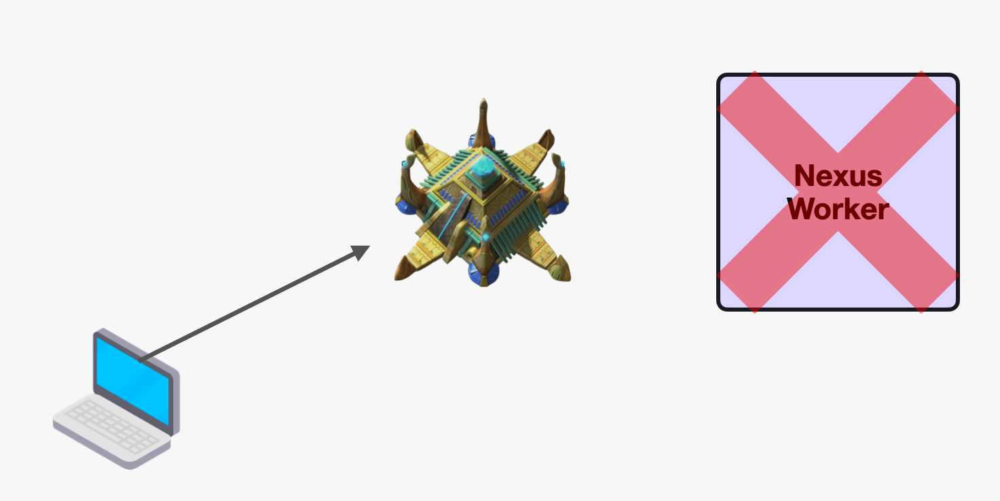

**Contents:**

- [Terminology](#terminology)
- [User flows](#user-flows)
  - [Hosting a Nexus Service](#hosting-a-nexus-service)
  - [Consuming a Nexus Service from Temporal](#consuming-a-nexus-service-from-temporal)
- [Concepts](#concepts)
  - [Nexus Instantiation](#nexus-instantiation)
  - [Nexus CRUD](#nexus-crud)
  - [Nexus Task hosting](#nexus-task-hosting)
  - [Nexus Task Worker](#nexus-task-worker)
  - [Calling Nexus from Temporal](#calling-nexus-from-temporal)

## Terminology

**Nexus Service Instance:** Formally registered Nexus Service with a Nexus backend (eg: Temporal).  Nexus Instances must always have a unique identifier.

**Nexus Task:** Unit of work which is run as a result of a request reaching the Nexus endpoint. Nexus Tasks are developed and operated similar to WorkflowTasks and ActivityTasks (eg: run and hosted on Nexus Workers). Within a Nexus Task Handler, developers can transform incoming payloads, make routing decisions and more.

**Nexus Task Handler:** Source code which is designed to handle incoming Nexus Tasks. Nexus Task Handler is similar to a Workflow or Activity definition and is hosted by a Nexus Worker. 

**Nexus Worker:** A special purpose Worker that pulls Nexus Tasks for its registered Nexus Instances from the Server and executes them using associated Nexus Task Handlers. 

## User flows

### Hosting a Nexus Service

1. User instantiates Nexus Service Instance using provided `nexus` CLI commands (also possible via SDK or API).
1. User defines a Nexus Task Handler that will handle the processing of Nexus Tasks for the instantiated Nexus Service Instance.
1. User hosts their Nexus Task Handler using a Nexus Worker. They must specify the Nexus Service Instance ID when starting the Nexus Worker.

	// TODO (Chad): show how registration would work for generic handler
    ```go
    func main() {
        ctx := context.TODO()

        // Create Nexus client
        client, err := client.Dial(ctx, client.Options{Target: "nexus-backend.example.com"})
        if err != nil {
            log.Fatal(err)
        }
        defer client.Close()

        // Build worker with Temporal pieces
        temporalClient, err := temporalclient.Dial(temporalclient.Options{HostPort: "nexus-backend.example.com:7233"})
        if err != nil {
            log.Fatal(err)
        }
        defer temporalClient.Close()
        builder, err := temporalnexus.NewWorkerBuilder(temporalnexus.WorkerBuilderOptions{Client: temporalClient})
        if err != nil {
            log.Fatal(err)
        }
        // Add workflow as ALO to Nexus
        err = builder.AddWorkflowALOHandler("foo", temporalnexus.WorkflowALOHandlerOptions{
            Workflow: FooWorkflow,
            Options:  temporalclient.StartWorkflowOptions{TaskQueue: "my-task-queue"},
        })
        if err != nil {
            log.Fatal(err)
        }

        // Worker definition...
    }
    ```
1. Nexus is now able to receive and process traffic on its frontend endpoint.

### Consuming a Nexus Service from Temporal

1. User asks the Nexus Service author for the endpoint of the Nexus Service Instance they are trying to consume. For Temporal based Nexus Service Instances, the endpoint will not be HTTP or gRPC but rather a custom uri formulation.
2. User registers provided endpoint to Nexus Worker, similarly to how you would register Workflows and Activities with a Worker. 
3. User calls the external Nexus Service using a Workflow-specific Nexus API which is provided by Temporal.
    ```go
    // calling a Nexus from a Temporal Workflow
    func MyWorkflow(ctx workflow.Context, name string) (string, error) {
        client := temporalnexus.NewWorkflowClient(temporalnexus.WorkflowClientOptions{Endpoint: "temporal:72aA64A0jhOL99B2"})
        // Start some alo
        alo, err := client.StartALO(ctx, temporalnexus.WorkflowStartALOOptions{
            Name: "foo",
            ID:   "my-id",
            Arg:  name,
        })
        if err != nil {
            return "", err
        }
        // Workflow implementation...
    }
    ```

## Concepts

### Nexus Instantiation

Instantiating a Nexus Service makes it possible for the Nexus Backend to receive traffic meant for that specific Instance. Nexus Instantiation does make your Nexus Service Instance endpoint(s) available for traffic, but until you register and run corresponding Nexus Task Workers, no forward progress will be made on incoming requests. In this way, sending requests at this stage is similar to starting Workflows without any Workflow Workers running.

**Registration:**

For the sake of this proposal, we will only consider the case where Nexus is registered via `nexus` CLI. In the future we may evaluate and consider alternative methods of registering a Nexus Service Instance. Registering a Nexus Service Instance would be done with the following command structure:

`nexus service register --service-name my-service --service-description "My service" --backend nexus-backend.example.com` 

This would result in the following output being displayed

// TODO (Chad): if this spits out a Temporal uri the cli should probably have an option to denote that

```bash
$ nexus service register --service-name my-service --service-description "My service" --backend nexus-backend.example.com

Nexus registered successfully with instance name "my-service"!
Available at:
	Temporal: temporal:72aA64A0jhOL99B2
```

**What is the behavior after running this command?**



The Nexus Instance is now registered and available via Nexus backend and should be reachable via the provided endpoint. Sending requests to the endpoint is possible even at this stage, but there should be no expectation of a response or of forward progress of the request. This is because while the Nexus Instance is registered and available, we have not run any corresponding Nexus Workers. In this way, sending requests at this stage is similar to starting Workflows without any Workflow Workers running.

### Nexus CRUD

Outside of creating a Nexus Service Instance, a general purpose CRUD API is provided that enables users to:

- List instantiated Nexus Service Instances
- Remove previously instantiated Nexus Service Instances
- Replace a Nexus Service Instance definition
- Get info about an existing Nexus Service Instance

### Nexus Task hosting

Now that the Nexus Service is registered with a Nexus Backend, we have to define, register and run a Nexus Task Handler in order to handle the incoming requests to our endpoint.

The Nexus payloads will be passed through the system before eventually being picked up by an appropriate Nexus Task Worker. Just as with Workflow and Activity Tasks, Nexus Tasks are not parsed or deeply introspected before being delivered. This also means that DataConverter functionality is unhindered and can be fully used with Nexus. 

Here is a proposed API of the Nexus Task Handler:

// TODO (Chad): show Nexus Handler without HTTP (Temporal specific).

```go
package main

import (
  "context"
  "encoding/json"
  "fmt"
  "net/http"

  "github.com/cretz/nexus-poc/sdk/go/nexus/backend/client"
  "github.com/cretz/nexus-poc/sdk/go/nexus/backend/worker"
)

func HandleMyServiceRequest(ctx context.Context, req *worker.CallRequest) *worker.CallResponse {
  // Validate HTTP
  if req.HTTP == nil {
    return worker.ErrInvalidProtocol
  } else if req.HTTP.RelativePath != "/foo" {
    // Note the relative path has the service stripped
    return worker.NewHTTPError(http.StatusNotFound)
  } else if req.HTTP.Request.Method != "GET" {
    return worker.NewHTTPError(http.MethodNotAllowed)
  } else if req.HTTP.Request.Header.Get("Content-Type") != "application/json" {
    return worker.NewHTTPErrorf(http.StatusBadRequest, "Invalid input")
  }
  
  // Read body
  reqBody := struct{ Name string `json:"name"` }{}
  b, err := io.ReadAll(req.HTTP.Request.Body)
  if closeErr := req.HTTP.Request.Body.Close(); closeErr != nil && err == nil {
    err = closeErr
  }
  if err == nil {
    err = json.Unmarshal(b, &reqBody)
  }
  if err != nil {
    return worker.NewHTTPErrorf(http.StatusBadRequest, "Invalid input: %w", err)
  }

  // Respond with foo JSON body
  b, _ := json.Marshal(map[string]string{"foo": fmt.Sprintf("Hello, %v!", reqBody.Name)})
  return worker.NewHTTPOKResponse(b, "Content-Type", "application/json")
}
```

**What’s possible within a Nexus Task Handler?**

Within a Nexus Task Handler, the rules are similar to that of an Activity. Nexus Task Handlers enables:

- Making external RPC calls or other I/O operations.
- Using a full-fledged Temporal client for kicking off Workflows or interacting with other Temporal resources.
- Interacting with the originating Request through a formal Response.

### Nexus Task Worker

In order to make forward progress on incoming Nexus Tasks, a valid Nexus Worker for the Nexus Instance must be registered.

// TODO (Chad): improve if needed

```go
package main

import (
	"context"
	"fmt"
	"log"
	"os"
	"os/signal"

	"github.com/cretz/nexus-poc/sdk/go/nexus/backend/client"
	"github.com/cretz/nexus-poc/sdk/go/nexus/backend/worker"
	"github.com/cretz/nexus-poc/sdk/temporal-go/temporalnexus"
	temporalclient "go.temporal.io/sdk/client"
	temporalworker "go.temporal.io/sdk/worker"
)

func main() {
	ctx := context.TODO()

	// Create client
	client, err := client.Dial(ctx, client.Options{Target: "nexus-backend.example.com"})
	if err != nil {
		log.Fatal(err)
	}
	defer client.Close()

	// Build worker with Temporal pieces
	temporalClient, err := temporalclient.Dial(temporalclient.Options{HostPort: "nexus-backend.example.com:7233"})
	if err != nil {
		log.Fatal(err)
	}
	defer temporalClient.Close()
	builder, err := temporalnexus.NewWorkerBuilder(temporalnexus.WorkerBuilderOptions{Client: temporalClient})
	if err != nil {
		log.Fatal(err)
	}

	// Add workflow
	err = builder.AddWorkflowALOHandler("foo", temporalnexus.WorkflowALOHandlerOptions{
		Workflow: SayHelloWorkflow,
		Options:  temporalclient.StartWorkflowOptions{TaskQueue: "my-task-queue"},
	})
	if err != nil {
		log.Fatal(err)
	}

	// Add queries and signals
	err = builder.AddQuerySyncHandler("foo/get", temporalnexus.QuerySyncHandlerOptions{
		Query: "get-foo",
	})
	if err != nil {
		log.Fatal(err)
	}
	err = builder.AddSignalSyncHandler("foo/update-prefix", temporalnexus.SignalSyncHandlerOptions{
		Signal: "update-prefix",
	})
	if err != nil {
		log.Fatal(err)
	}
	err = builder.AddSignalSyncHandler("foo/finish", temporalnexus.SignalSyncHandlerOptions{
		Signal: "finish-workflow",
	})
	if err != nil {
		log.Fatal(err)
	}

	// Start Temporal worker
	temporalWorker := temporalworker.New(temporalClient, "my-task-queue", temporalworker.Options{})
	temporalWorker.RegisterWorkflow(SayHelloWorkflow)
	if err := temporalWorker.Start(); err != nil {
		log.Fatal(err)
	}
	defer temporalWorker.Stop()

	// Start Nexus worker
	worker, err := worker.New(worker.Options{Client: client, Service: "my-service", Handler: builder.BuildHandler()})
	if err != nil {
		log.Fatal(err)
	} else if err = worker.Start(ctx); err != nil {
		log.Fatal(err)
	}
	defer worker.Stop()

	// Wait for completion
	log.Print("Worker started, ctrl+c to stop")
	signalCh := make(chan os.Signal, 1)
	signal.Notify(signalCh, os.Interrupt)
	<-signalCh
}
```

### Calling Nexus from Temporal

```go
package main

import (
	"context"
	"fmt"

	"github.com/cretz/nexus-poc/sdk/go/nexus/backend/backendpb"
	"github.com/cretz/nexus-poc/sdk/temporal-go/temporalnexus"
	"go.temporal.io/sdk/workflow"
)

// Example of a workflow calling ALOs and sync calls
func MyParentWorkflow(ctx workflow.Context, name string) (string, error) {
	// Create client. Note this doesn't take a context. It could technically be
	// created _outside_ of the workflow.
	client := temporalnexus.NewWorkflowClient(temporalnexus.WorkflowClientOptions{Endpoint: "temporal:72aA64A0jhOL99B2"})

	// Start foo ALO
	alo, err := client.StartALO(ctx, temporalnexus.WorkflowStartALOOptions{
		Name: "foo",
		ID:   "my-id",
		Arg:  name,
	})
	if err != nil {
		return "", err
	}

	// Load info and confirm it is running
	if info, err := alo.LoadInfo(ctx); err != nil {
		return "", err
	} else if info.Status != backendpb.AloInfo_RUNNING {
		return "", fmt.Errorf("expected running, got status: %v", info.Status)
	}

	// Send a query and confirm it is the default foo
	var resultStr string
	res, err := client.CallSync(ctx, temporalnexus.WorkflowCallSyncOptions{Name: "foo/get", ALOID: "my-id"})
	if err != nil {
		return "", err
	} else if err = res.Get(&resultStr); err != nil {
		return "", err
	} else if resultStr != "Hello, Nexus!" {
		return "", fmt.Errorf("expected normal foo, got: %q", resultStr)
	}

	// Send a signal to update the prefix, then another signal to finish the
	// workflow
	_, err = client.CallSync(ctx, temporalnexus.WorkflowCallSyncOptions{
		Name:  "foo/update-prefix",
		ALOID: "my-id",
		Arg:   "Howdy",
	})
	if err != nil {
		return "", err
	}
	_, err = client.CallSync(ctx, temporalnexus.WorkflowCallSyncOptions{Name: "foo/finish", ALOID: "my-id"})
	if err != nil {
		return "", err
	}

	// Now return the result
	if res, err := alo.WaitForResult(ctx); err != nil {
		return "", err
	} else if err = res.Get(&resultStr); err != nil {
		return "", err
	}
	return resultStr, nil
}
```