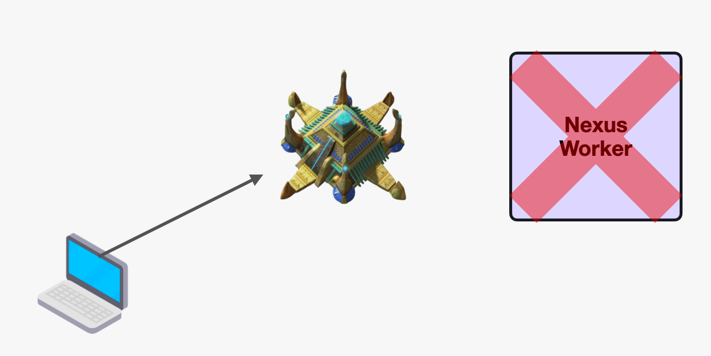

**Contents:**

- [Terminology](#terminology)
- [User flows](#user-flows)
  - [Hosting a Nexus Service](#hosting-a-nexus-service)
  - [Consuming a Nexus Service from Temporal](#consuming-a-nexus-service-from-temporal)
- [Concepts](#concepts)
  - [Nexus Instantiation](#nexus-instantiation)
  - [Nexus CRUD](#nexus-crud)
  - [Nexus Request Handler hosting](#nexus-request-handler-hosting)
  - [Calling Nexus from Temporal](#calling-nexus-from-temporal)
  - [Nexus Worker](#nexus-worker)

## Terminology

**Nexus Service Instance:** Formally registered Nexus Service with a Nexus backend (eg: Temporal).  Nexus Instances must always have a unique identifier.

**Nexus Request:** Unit of work which is run as a result of a request reaching the Nexus endpoint. Nexus Requests are developed and operated similar to WorkflowTasks and ActivityTasks (eg: run and hosted on Nexus Workers). Within a Nexus Request Handler, developers can transform incoming payloads, make routing decisions and more.

**Nexus Request Handler:** Source code which is designed to handle incoming Nexus Requests. Nexus Request Handler is similar to a Workflow or Activity definition and is hosted by a Nexus Worker.

**Nexus Worker:** A special purpose Worker that pulls Nexus Requests for its registered Nexus Instances from the Server and executes them using associated Nexus Request Handlers.

## User flows

### Hosting a Nexus Service

1. User instantiates Nexus Service Instance using provided `nexus` CLI commands (also possible via SDK or API) and receives an Instance URI. Nexus is now able to receive requests to its frontend endpoint (though they don't get processed until step 4).
1. User defines a Nexus Request Handler that will handle the processing of Nexus Requests for the instantiated Nexus Service Instance.
1. User hosts their Nexus Request Handler using a Nexus Worker. They must specify the Nexus Service Instance URI when starting the Nexus Worker.

    // TODO (Chad): show how registration would work for generic handler
    ```go
    func main() {
        ctx := context.TODO()

        // Create Nexus client
        client, err := client.Dial(ctx, client.Options{Target: "nexus-backend.example.com"})
        if err != nil {
            log.Fatal(err)
        }
        defer client.Close()

        // Build worker with Temporal pieces
        temporalClient, err := temporalclient.Dial(temporalclient.Options{HostPort: "nexus-backend.example.com:7233"})
        if err != nil {
            log.Fatal(err)
        }
        defer temporalClient.Close()
        builder, err := temporalnexus.NewWorkerBuilder(temporalnexus.WorkerBuilderOptions{Client: temporalClient})
        if err != nil {
            log.Fatal(err)
        }
        // Add workflow as ALO to Nexus
        err = builder.AddWorkflowALOHandler("foo", temporalnexus.WorkflowALOHandlerOptions{
            Workflow: FooWorkflow,
            Options:  temporalclient.StartWorkflowOptions{TaskQueue: "my-task-queue"},
        })
        if err != nil {
            log.Fatal(err)
        }

        // Worker definition...
    }
    ```
1. Nexus is now able to process requests to its frontend endpoint.

### Consuming a Nexus Service from Temporal

1. User asks the Nexus Service author for the endpoint of the Nexus Service Instance they are trying to consume. For Temporal based Nexus Service Instances, the endpoint will not be HTTP or gRPC but rather a custom URI formulation.
2. User registers the provided Nexus URI with the Temporal Server by providing an explicit mapping between canonical name and the fully qualified URI (eg: `production: temporal:72aA64A0jhOL99B2`).
3. User calls the external Nexus Service using a Workflow-specific Nexus API which is provided by Temporal.
    ```go
    // calling a Nexus from a Temporal Workflow
    func MyWorkflow(ctx workflow.Context, name string) (string, error) {
        // Start some ALO
        alo, err := client.ALO(ctx, temporalnexus.StartAloOptions{
            Nexus: "production", // maps to temporal:72aA64A0jhOL99B2 because it was registered with the server
            Name: "foo",
            ID:   "my-id",
            Arg:  name,
        })
        if err != nil {
            return "", err
        }
        // Workflow implementation...
    }
    ```

## Concepts

### Nexus Instantiation

Instantiating a Nexus Service makes it possible for the Nexus Backend to receive traffic meant for that specific Instance. Nexus Instantiation does make your Nexus Service Instance endpoint(s) available for traffic, but until you register and run corresponding Nexus Workers, no forward progress will be made on incoming requests. In this way, sending requests at this stage is similar to starting Workflows without any Workflow Workers running.

**Note:** Meaningfully persisting the in flight Nexus Requests is not a product level requirement. Some users may not want Nexus Request payloads to be persisted and we should leave an opening for that in the design.

**Registration:**

For the sake of this proposal, we will only consider the case where Nexus is registered via `nexus` CLI. In the future we may evaluate and consider alternative methods of registering a Nexus Service Instance. Registering a Nexus Service Instance would be done with the following command structure:

`tctl nexus register --name my-service --description "My service" --backend nexus-backend.example.com`

This would result in the following output being displayed

// TODO (Chad): if this spits out a Temporal uri the cli should probably have an option to denote that

```bash
$ tctl nexus register --service-name my-service --service-description "My service" --backend nexus-backend.example.com

Nexus registered successfully with instance name "my-service"!
Available at:
    Temporal: temporal:72aA64A0jhOL99B2
```

**What is the behavior after running this command?**



The Nexus Instance is now registered and available via Nexus backend and should be reachable via the provided endpoint. Sending requests to the endpoint is possible even at this stage, but there should be no expectation of a response or of forward progress of the request. This is because while the Nexus Instance is registered and available, we have not run any corresponding Nexus Workers. In this way, sending requests at this stage is similar to starting Workflows without any Workflow Workers running.

### Nexus CRUD

Outside of creating a Nexus Service Instance, a general purpose CRUD API is provided that enables users to:

- List instantiated Nexus Service Instances
- Remove previously instantiated Nexus Service Instances
- Replace a Nexus Service Instance definition
- Get info about an existing Nexus Service Instance

### Nexus Request Handler hosting

Now that the Nexus Service is registered with a Nexus Backend, we have to define, register and run a Nexus Request Handler in order to handle the incoming requests to our endpoint.

The Nexus payloads will be passed through the system before eventually being picked up by an appropriate Nexus Worker. Just as with Workflow and Activity Tasks, Nexus Requests are not parsed or deeply introspected before being delivered. This also means that DataConverter functionality is unhindered and can be fully used with Nexus.

Here is a proposed API of the Nexus Request Handler:

```go
type myNexusHandler struct{}

func (myNexusHandler) ServeNexus(nexus.ResponseWriter, *nexus.Request) error {
  panic("Not implemented")
}

func main() {
  // Create Nexus client
  client, err := nexus.DialClient(ctx, nexus.ClientOptions{Target: "nexus-backend.example.com"})
  if err != nil {
    log.Fatal(err)
  }
  defer client.Close()

  // Start worker
  worker, err := nexus.NewWorker(nexus.WorkerOptions{
    Client: client,
    Handler: myNexusHandler{},
    Service: "foo",
  }
  if err != nil {
    log.Fatal(err)
  } else if err = worker.Start(ctx); err != nil {
    log.Fatal(err)
  }
  defer worker.Stop()

  // Wait for signal
  signalCh := make(chan os.Signal, 1)
  signal.Notify(signalCh, os.Interrupt)
  <-signalCh
}
```

**What’s possible within a Nexus Request Handler?**

Within a Nexus Request Handler, the rules are similar to that of an Activity. Nexus Request Handlers enables:

- Making external RPC calls or other I/O operations.
- Using a full-fledged Temporal client for kicking off Workflows or interacting with other Temporal resources.
- Interacting with the originating Request through a formal Response.

### Calling Nexus from Temporal


```go
package main

import (
	"context"
	"fmt"

	"github.com/cretz/nexus-poc/sdk/temporal-go/temporalnexus"
	"go.temporal.io/sdk/workflow"
)

// Example of a workflow calling ALOs and sync calls
func MyParentWorkflow(ctx workflow.Context, name string) (string, error) {
	// Start foo ALO
	alo, err := client.ALO(ctx, temporalnexus.Options{
		Nexus: "production", // maps to 'temporal:72aA64A0jhOL99B2' on the server
		Name: "foo",
		ID:   "my-id",
		Arg:  name,
	})
	if err != nil {
		return "", err
	}

	// Load info and confirm it is running
	if info, err := alo.LoadInfo(ctx); err != nil {
		return "", err
	} else if info.Status != temporalnexus.AloInfo_RUNNING {
		return "", fmt.Errorf("expected running, got status: %v", info.Status)
	}

	// Send a query and confirm it is the default foo
	var resultStr string
	res, err := client.ALO(ctx, temporalnexus.Options{
		Nexus: "production", // maps to 'temporal:72aA64A0jhOL99B2' on the server
		Name: "foo/get",
		ALOID: "my-id"
	})
	if err != nil {
		return "", err
	} else if err = res.Get(&resultStr); err != nil {
		return "", err
	} else if resultStr != "Hello, Nexus!" {
		return "", fmt.Errorf("expected normal foo, got: %q", resultStr)
	}

	// Send a signal to update the prefix, then another signal to finish the
	// workflow
	_, err = client.ALO(ctx, temporalnexus.Options{
		Nexus: "production", // maps to 'temporal:72aA64A0jhOL99B2' on the server
		Name:  "foo/update-prefix",
		ALOID: "my-id",
		Arg:   "Howdy",
	})
	if err != nil {
		return "", err
	}
	_, err = client.ALO(ctx, temporalnexus.Options{
		Nexus: "production", // maps to 'temporal:72aA64A0jhOL99B2' on the server
		Name: "foo/finish",
		ALOID: "my-id"
	})
	if err != nil {
		return "", err
	}

	// Now return the result
	if res, err := alo.WaitForResult(ctx); err != nil {
		return "", err
	} else if err = res.Get(&resultStr); err != nil {
		return "", err
	}
	return resultStr, nil
}
```

### Nexus Worker

In order to make forward progress on incoming Nexus Requests, a valid Nexus Worker for the Nexus Instance must be registered.

// TODO (Chad): improve if needed

```go
package main

import (
	"context"
	"fmt"
	"log"
	"os"
	"os/signal"

	"github.com/cretz/nexus-poc/sdk/go/nexus/backend/client"
	"github.com/cretz/nexus-poc/sdk/go/nexus/backend/worker"
	"github.com/cretz/nexus-poc/sdk/temporal-go/temporalnexus"
	temporalclient "go.temporal.io/sdk/client"
	temporalworker "go.temporal.io/sdk/worker"
)

func main() {
	ctx := context.TODO()

	// Create client
	client, err := client.Dial(ctx, client.Options{Target: "nexus-backend.example.com"})
	if err != nil {
		log.Fatal(err)
	}
	defer client.Close()

	// Build worker with Temporal pieces
	temporalClient, err := temporalclient.Dial(temporalclient.Options{HostPort: "nexus-backend.example.com:7233"})
	if err != nil {
		log.Fatal(err)
	}
	defer temporalClient.Close()
	builder, err := temporalnexus.NewWorkerBuilder(temporalnexus.WorkerBuilderOptions{Client: temporalClient})
	if err != nil {
		log.Fatal(err)
	}

	// Add workflow
	err = builder.AddALO("foo", temporalnexus.WorkflowALOHandlerOptions{
		Workflow: SayHelloWorkflow,
		Options:  temporalclient.StartWorkflowOptions{TaskQueue: "my-task-queue"},
	})
	if err != nil {
		log.Fatal(err)
	}

	// Add queries and signals
	err = builder.AddALO("foo/get", temporalnexus.QuerySyncHandlerOptions{
		Query: "get-foo",
	})
	if err != nil {
		log.Fatal(err)
	}
	err = builder.AddALO("foo/update-prefix", temporalnexus.SignalSyncHandlerOptions{
		Signal: "update-prefix",
	})
	if err != nil {
		log.Fatal(err)
	}
	err = builder.AddALO("foo/finish", temporalnexus.SignalSyncHandlerOptions{
		Signal: "finish-workflow",
	})
	if err != nil {
		log.Fatal(err)
	}

	// Start Temporal worker
	temporalWorker := temporalworker.New(temporalClient, "my-task-queue", temporalworker.Options{})
	temporalWorker.RegisterWorkflow(SayHelloWorkflow)
	if err := temporalWorker.Start(); err != nil {
		log.Fatal(err)
	}
	defer temporalWorker.Stop()

	// Start Nexus worker
	worker, err := worker.New(worker.Options{Client: client, Service: "my-service", Handler: builder.BuildHandler()})
	if err != nil {
		log.Fatal(err)
	} else if err = worker.Start(ctx); err != nil {
		log.Fatal(err)
	}
	defer worker.Stop()

	// Wait for completion
	log.Print("Worker started, ctrl+c to stop")
	signalCh := make(chan os.Signal, 1)
	signal.Notify(signalCh, os.Interrupt)
	<-signalCh
}
```
