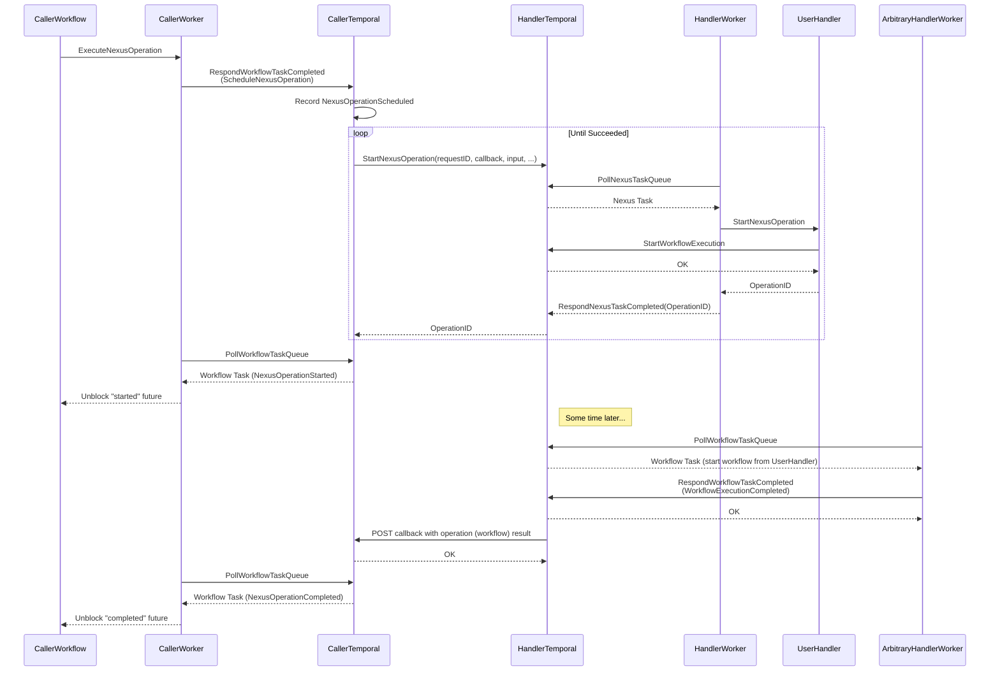
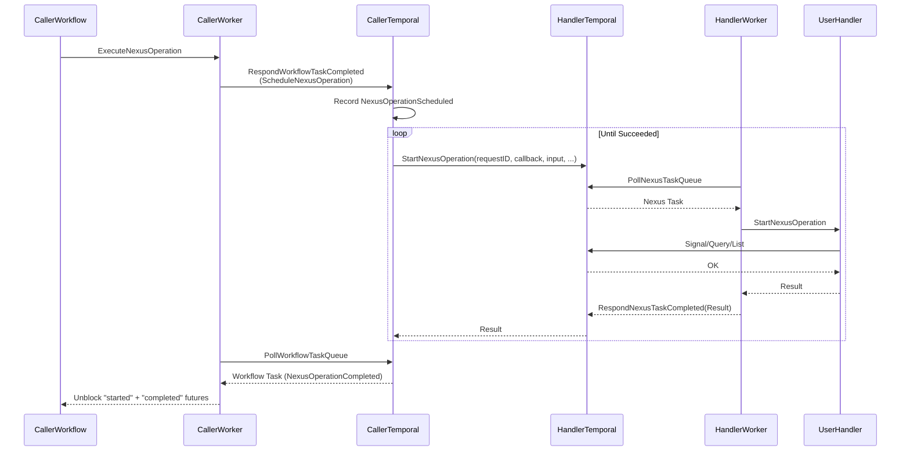

# Nexus APIs for the Temporal Go SDK

## Background

Nexus RPC is a modern open-source service framework for arbitrary-length operations whose lifetime may extend beyond a
traditional RPC. Nexus was designed with durable execution in mind, as an underpinning to connect durable executions
within and across namespaces, clusters and regions – with a clean API contract to streamline multi-team collaboration.
Any service can be exposed as a set of sync or async Nexus operations – the latter provides an operation identity and a
uniform interface to get the status of an operation or its result, receive a completion callback, or cancel the
operation.

Temporal is leveraing the Nexus RPC protocol to facilitate calling across namespace and cluster and boundaries.

### Prior Art

- [Nexus over HTTP Spec](https://github.com/nexus-rpc/api/blob/main/SPEC.md)
- [Nexus SDK Go](https://github.com/nexus-rpc/sdk-go)

### This Proposal

This proposal discusses exposing Nexus concepts in the Temporal Go SDK, reusing definitions from the Nexus Go SDK.

> NOTE: The proposed APIs will all be marked experimental until we get user feedback and we feel they've matured enough.

## Temporal Operations

### NewSyncOperation

`NewSyncOperation` creates a synchronous operation, passing the client the worker was created with as an argument to the
handler. Sync operations are useful for exposing short-lived Temporal client requests, such as signals, queries, sync
update, list workflows, etc...

```go
package temporalnexus

import "github.com/nexus-rpc/sdk-go/nexus"

func NewSyncOperation[I any, O any](
	name string,
	handler func(context.Context, client.Client, I, nexus.StartOperationOptions) (O, error),
) nexus.Operation[I, O]
```

> NOTE: this is a simple wrapper around the Nexus Go SDK's
> [NewSyncOperation](https://pkg.go.dev/github.com/nexus-rpc/sdk-go@v0.0.7/nexus#NewSyncOperation), which can be used in
> sync operations that don't require a Temporal client.

**Usage**:

```go
import (
	"github.com/nexus-rpc/sdk-go/nexus"
	"go.temporal.io/sdk/client"
	"go.temporal.io/sdk/temporalnexus"
)

opGetStatus := temporalnexus.NewSyncOperation("get-status", func(ctx context.Context, c client.Client, id string, opts nexus.StartOperationOptions) (int, error) {
	res, err := c.QueryWorkflow(ctx, id, "", "some-query", nil)
	if err != nil {
		return 0, err
	}
	var ret int
	return ret, res.Get(&ret)
})

// Operations don't have to return values.
opContinue := temporalnexus.NewSyncOperation("continue-processing", func(ctx context.Context, c client.Client, id string, opts nexus.StartOperationOptions) (nexus.NoValue, error) {
	return nil, c.SignalWorkflow(ctx, id, "", "continue-processing", nil)
})
```

### NewWorkflowRunOperation

```go
package temporalnexus

import (
	"github.com/nexus-rpc/sdk-go/nexus"
	"go.temporal.io/sdk/client"
)

// NewWorkflowRunOperation map an operation to a workflow run.
func NewWorkflowRunOperation[I, O any](
	name string,
	workflow func(internal.Context, I) (O, error),
	getOptions func(context.Context, I, nexus.StartOperationOptions) (client.StartWorkflowOptions, error),
) nexus.Operation[I, O]

type WorkflowRunOperationOptions[I, O any] struct {
	// Operation name.
	Name string
	// Workflow function to map this operation to. The operation input maps directly to workflow input.
	// The workflow name is resolved as it would when using this function in client.ExecuteOperation.
	// OptionsGetter must be provided when setting this option. Mutually exclusive with Handler.
	Workflow func(internal.Context, I) (O, error)
	// Options for starting the workflow. Must be set if Workflow is set. Mutually exclusive with Handler.
	OptionsGetter func(context.Context, I, nexus.StartOperationOptions) (client.StartWorkflowOptions, error)
	// Handler for starting a workflow with a different input than the operation. Mutually exclusive with Workflow.
	Handler func(context.Context, I, nexus.StartOperationOptions) (WorkflowHandle[O], error)
}

// NewWorkflowRunOperation map an operation to a workflow run with the given options.
func NewWorkflowRunOperationWithOptions[I, O any](opts WorkflowRunOperationOptions[I, O]) nexus.Operation[I, O]

type WorkflowHandle[T any] interface {
	ID() string
	RunID() string
}

// ExecuteWorkflow starts a workflow run, linking the execution chain to a Nexus operation (subsequent runs started from
// continue-as-new and retries).
// Automatically propagates the callback and request ID from the nexus options to the workflow.
func ExecuteWorkflow[I, O any, WF func(internal.Context, I) (O, error)](
	ctx context.Context,
	nexusOptions nexus.StartOperationOptions,
	startWorkflowOptions client.StartWorkflowOptions,
	workflow WF,
	arg I,
) (WorkflowHandle[O], error)

// ExecuteUntypedWorkflow starts a workflow with by function reference or string name, linking the execution chain to a
// Nexus operation.
// Useful for invoking workflows that don't follow the single argument - single return type signature.
// See [ExecuteWorkflow] for more information.
func ExecuteUntypedWorkflow[R any](
	ctx context.Context,
	nexusOptions nexus.StartOperationOptions,
	startWorkflowOptions client.StartWorkflowOptions,
	workflow any,
	args ...any,
) (WorkflowHandle[R], error)
```

**Usage**:

```go
import (
	"github.com/nexus-rpc/sdk-go/nexus"
	"go.temporal.io/sdk/client"
	"go.temporal.io/sdk/temporalnexus"
)

func MyHandlerWorkflow(workflow.Context, MyInput) (MyOutput, error)
func MyHandlerWorkflowWithAlternativeInput(workflow.Context, MyWorkflowInput) (MyOutput, error)

// Alternative 1 - shortest form, for workflows that have input and outputs that map 1:1 with the operation's I/O.
opStartTransactionAlt1 := temporalnexus.NewWorkflowRunOperation(
	"start-transaction",
	MyHandlerWorkflow,
	func(ctx context.Context, input MyInput, opts nexus.StartOperationOptions) (client.StartWorkflowOptions, error) {
		return client.StartWorkflowOptions{
			ID: input.ID,
		}, nil
	})

// Alternative 2 - same as above but using the "WithOptions" method.
opStartTransactionAlt2 := temporalnexus.NewWorkflowRunOperationWithOptions(
	temporalnexus.WorkflowRunOperationOptions[MyInput, MyOutput]{
		Name: "start-transaction",
		Workflow: MyHandlerWorkflow,
		OptionsGetter: func(ctx context.Context, input MyInput, opts nexus.StartOperationOptions) (client.StartWorkflowOptions, error) {
			return client.StartWorkflowOptions{
				ID: input.ID,
			}, nil
		},
	})

// Alternative 3 - start a workflow with alternative inputs.
opStartTransactionAlt3 := temporalnexus.NewWorkflowRunOperationWithOptions(
	temporalnexus.WorkflowRunOperationOptions[MyInput, MyOutput]{
		Name: "start-transaction",
		Handler: func(ctx context.Context, input MyInput, opts nexus.StartOperationOptions) (temporalnexus.WorkflowHandle[MyOutput], error) {
			// Workflows started with this API must take a single input and return single output.
			return temporalnexus.ExecuteWorkflow(ctx, client.StartWorkflowOptions{
				ID: input.ID,
			}, MyHandlerWorkflowWithAlternativeInput, MyWorkflowInput{})
		},
	})

// Alternative 4 - start a workflow with an arbitrary number of inputs (either using a string or workflow function for
// the name).
opStartTransactionAlt4 := temporalnexus.NewWorkflowRunOperationWithOptions(
	temporalnexus.WorkflowRunOperationOptions[MyInput, MyOutput]{
		Name: "start-transaction",
		Handler: func(ctx context.Context, input MyInput, opts nexus.StartOperationOptions) (temporalnexus.WorkflowHandle[MyOutput], error) {
			// Run any arbitrary workflow.
			return temporalnexus.ExecuteUntypedWorkflow[MyOutput](ctx, client.StartWorkflowOptions{
				ID: input.ID,
			}, "SomeOtherWorkflow", input1, input2, input3)
		},
	})
```

### Register an Operation with a Worker

We define a `NexusOperationRegistry` interface with a single method `RegisterNexusOperation` and embed it in the
`Registry` interface:

```go
import "github.com/nexus-rpc/sdk-go/nexus"

Registry interface {
	WorkflowRegistry
	ActivityRegistry
	NexusOperationRegistry // <-- New
}

NexusOperationRegistry interface {
	// RegisterNexusOperation registers an operation with a worker. Panics if an operation with the same name has
	// already been registered on this worker or if the worker has already been started. A worker will only poll for
	// Nexus tasks if any operations are registered on it.
	RegisterNexusOperation(op nexus.RegisterableOperation)
}
```

**Usage**:

```go
myWorker.RegisterNexusOperation(myOperation)
```

## Starting an Operation from a Workflow

The `ExecuteNexusOperation` API is modelled after `ExecuteChildWorkflow`, leveraging futures that can be used with the
SDK's selectors.

> NOTE: In the future, as the Go SDK adds support for typed futures, we will add a strongly typed variant of this API.

```go
package workflow

// NexusOperationOptions are options for starting a Nexus Operation from a Workflow.
type NexusOperationOptions struct {
	ScheduleToCloseTimeout time.Duration
}

// NexusOperationExecution is the result of [NexusOperationFuture.GetNexusOperationExecution].
type NexusOperationExecution struct {
	OperationID string
}

// NexusOperationFuture represents the result of a Nexus Operation.
type NexusOperationFuture interface {
	Future
	// GetNexusOperationExecution returns a future that is resolved when the operation reaches the STARTED state.
	// For synchronous operations, this will be resolved at the same as the containing [NexusOperationFuture]. For
	// asynchronous operations, this future is resolved independently.
	// If the operation is unsuccessful, this future will contain the same error as the [NexusOperationFuture].
	// Use this method to extract the Operation ID of an asynchronous operation. OperationID will be empty for
	// synchronous operations.
	GetNexusOperationExecution() Future
}

// ExecuteNexusOperation executes a Nexus Operation.
func ExecuteNexusOperation(ctx Context, service string, operation string, input any, options NexusOperationOptions) NexusOperationFuture
```

**Usage**:

```go
import (
	"fmt"
	"time"

	"go.temporal.io/sdk/workflow"
)

func MyCallerWorkflow(ctx workflow.Context) (MyOutput, error) {
	fut := workflow.ExecuteNexusOperation(ctx, "payments", "start-transaction", MyInput{ID: "tx-deadbeef"}, workflow.NexusOperationOptions{
		ScheduleToCloseTimeout: time.Hour,
	})
	var exec workflow.NexusOperationExecution
	_ = fut.GetNexusOperationExecution().Get(ctx, &exec)
	fmt.Println(exec.OperationID) // May be empty if the operation completed synchronously.
	var result MyOutput
	return result, fut.Get(ctx, &result)
}
```

> NOTE: To cancel a Nexus Operation, cancel the context used to execute it.

### Interceptors

For now we'll only intercept outbound APIs from a workflow, extending the `WorkflowOutboundInterceptor` interface.
More interceptors are likely to come later.

```go
type WorkflowOutboundInterceptor interface {
	ScheduleNexusOperation(ctx Context, service, operation string, input any, options NexusOperationOptions) NexusOperationFuture
	RequestCancelNexusOperation(ctx Context, service, operation, id string, options nexus.CancelOperationOptions) error
}
```

## Sequence

### Async Operation Flow



### Sync Operation Flow


