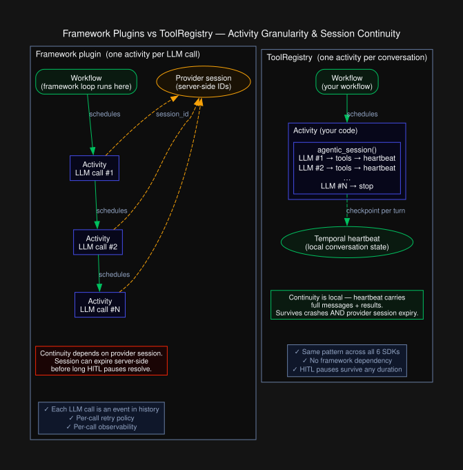
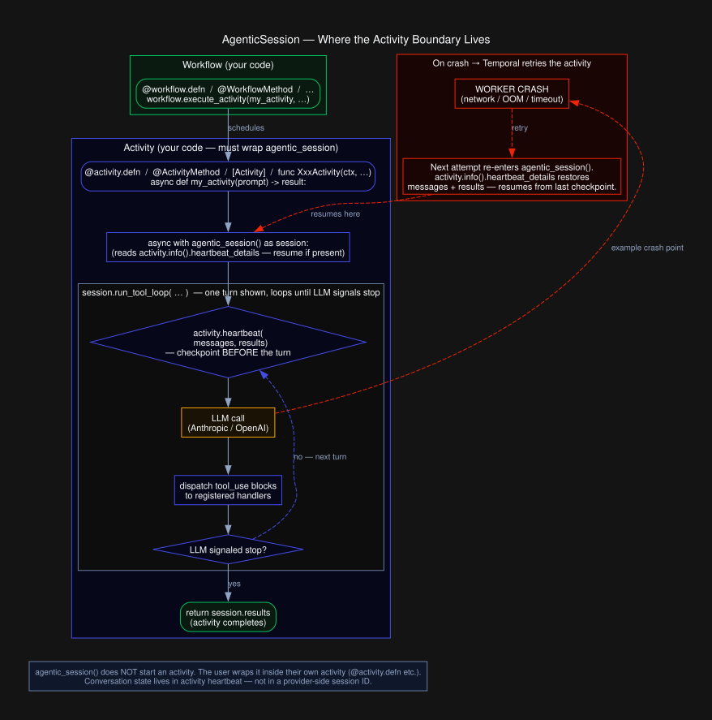

# Proposal: ToolRegistry + AgenticSession — Cross-SDK LLM Tool-Calling Primitives

**SDKs:** Python · TypeScript · Go · Java · Ruby · .NET

---

## Problem

LLM-backed activities are increasingly common in Temporal workflows, but every team writes the tool-calling loop themselves. The same pieces show up each time:

| | Today — hand-rolled inside an activity | With ToolRegistry + AgenticSession |
|---|---|---|
| Wire format | You serialize tool defs to Anthropic/OpenAI schema | One definition, both wire formats built in |
| Tool dispatch | You walk `tool_use` / `function` blocks and call handlers | `ToolRegistry` dispatches by name |
| Loop | You manage messages, iterate, detect stop | `run_tool_loop(...)` |
| Crash safety | You hand-write `activity.heartbeat` and the restore path | `agentic_session()` does it |
| Cross-SDK | Different code in every team and every SDK | Same shape in all 6 SDKs |

No shared abstraction exists today — not across teams, not across SDKs. This proposal defines two complementary primitives and ships them as contributed modules in all six official Temporal SDKs.

---

## Overview

Two abstractions cover the common cases:

**`ToolRegistry`** — maps tool names to JSON Schema definitions and handler functions, exports to Anthropic or OpenAI wire format, and dispatches model-selected tool calls.

**`AgenticSession`** — wraps a `ToolRegistry` loop with crash-safe heartbeating. Before every LLM turn it serializes the full conversation history and results list to Temporal's heartbeat; on activity retry it resumes from exactly where it left off. Because conversation state is stored locally in the heartbeat rather than through server-side session IDs, the session survives both activity crashes and provider-side session expiry.

Both are opt-in `contrib` modules (not part of the SDK core) and have no mandatory dependencies — LLM client libraries are `require`/`import`-ed at runtime only if a real provider is constructed.

---

## Use cases

**Code analysis and review**
The quickstart example: accumulate findings as the LLM calls tools, return them when the model signals it is done.

**Long-running research tasks**
Queries that span many tool calls and may take minutes. `AgenticSession` checkpoints after each turn — a crash mid-research resumes from the last completed turn, not from scratch.

**Human-in-the-loop tool calls**
A tool handler can send a Temporal signal to a workflow and block until a human approves the action. Because conversation state is local in the heartbeat (not in a provider-side session), the activity can sleep for hours waiting for approval without losing context. This pattern is not possible with framework plugins that rely on provider session IDs — those sessions expire. The human's decision (approved/rejected + reason) is returned to the LLM as the tool result, so the model can read a rejection and revise its next proposal. A crash while waiting is safe: deterministic workflow IDs let the retry re-attach to the existing approval workflow rather than re-notifying the reviewer. See the Python SDK README for a full working example (code review agent that proposes auto-fixes requiring human sign-off before application).

**MCP server integration**
`ToolRegistry.fromMcpTools` / `from_mcp_tools` / `FromMCPTools` converts an MCP tool list into a registry. Handlers can proxy calls to any MCP server. Combined with `AgenticSession`, the conversation survives MCP server restarts mid-loop.

**Provider migration**
Register tools once; swap the provider between Anthropic and OpenAI without touching handler code.

---

## Relationship to framework integrations

Temporal's Python and TypeScript SDKs ship higher-level integrations for specific agent frameworks: `openai_agents`, `google_adk_agents`, and `langgraph` in Python, and `ai-sdk` (Vercel AI SDK) in TypeScript. Those integrations intercept the framework's own model calls and run each one as a separate Temporal activity, using the framework's server-side session IDs to maintain conversation continuity.

ToolRegistry is a different layer:

| | Framework plugins | ToolRegistry |
|---|---|---|
| Available for | Python, TypeScript | All 6 SDKs |
| Requires | Specific agent framework | Anthropic or OpenAI SDK only |
| LLM call granularity | One activity per model call | One activity per conversation |
| Session continuity | Server-side (framework/API session IDs) | Local heartbeat state |
| Survives server-side session expiry | No | Yes |



**Use a framework plugin** when you are already using OpenAI Agents SDK, LangGraph, Google ADK, or Vercel AI SDK in Python or TypeScript and want each model call to be a separately visible, retryable Temporal activity.

**Use ToolRegistry** when:
- Working in Go, Java, Ruby, or .NET (no framework plugins exist for these SDKs)
- Calling Anthropic or OpenAI directly without an agent framework
- Needing conversation history to survive server-side session expiry (e.g., long-running sessions where API-side state may expire between turns)
- Wanting a single implementation pattern that works identically across all six SDKs

---

## Design decisions

### Tool definitions use JSON Schema inline

Each tool is described with a plain dictionary/map matching Anthropic's `tool_use` format (`name`, `description`, `input_schema`). This is also the schema required by the MCP protocol, making registry objects reusable with MCP tool descriptors.

OpenAI format is derived from the same definitions via `toOpenAI()` / `to_openai()`, which wraps each definition in the `{"type": "function", "function": {...}}` envelope OpenAI requires.

### Provider strategy: string vs. object

**Python and TypeScript** take `provider: str` (`"anthropic"` or `"openai"`) in `run_tool_loop`. The string is simpler to write in the common case and reduces the number of types a caller must import. The `AgenticSession.run_tool_loop` method also takes the string.

**Go, Java, Ruby, and .NET** use an explicit `Provider` object (interface in Java/Go/.NET, base class in Ruby). This makes testing cleaner — passing a `MockProvider` requires no magic — and exposes the seam used by `AgenticSession` to call into the model.

This difference is deliberate, not an oversight. Both approaches are idiomatic for their ecosystems.

The asymmetry surfaces in the testing API too: Python/TS pass `provider="mock"`, Go/Java/Ruby/.NET construct an explicit `MockProvider`. This is friction for cross-SDK doc readers; it is the cost of being idiomatic in each ecosystem.

### Ruby naming: `Registry` inside the `ToolRegistry` module

In Ruby the class is `Temporalio::Contrib::ToolRegistry::Registry`, not `ToolRegistry::ToolRegistry`. Repeating the outermost module name in the class name is un-idiomatic Ruby (same pattern used throughout the other Ruby contrib packages). Callers can alias freely:

```ruby
Registry = Temporalio::Contrib::ToolRegistry::Registry
```

### Session entry point style

Each SDK uses the idiomatic entry point for asynchronous callbacks:

| SDK | Entry point |
|-----|------------|
| Python | `async with agentic_session() as session:` |
| TypeScript | `await agenticSession(async (session) => { ... })` |
| Go | `toolregistry.RunWithSession(ctx, func(ctx, s) error { ... })` |
| Java | `AgenticSession.runWithSession(session -> { ... })` |
| Ruby | `AgenticSession.run_with_session { \|session\| ... }` |
| .NET | `await AgenticSession.RunWithSessionAsync(async session => { ... })` |

All are equivalent in behavior; the style difference is purely idiomatic.

### Heartbeat timing

The checkpoint is written **before** each LLM turn. If the activity is killed mid-turn, the next attempt re-issues the same turn. Conversation history is the source of truth — re-issuing is safe in the conversation-state sense.

**Crash semantics differ between the two variants.** With `run_tool_loop` (no session) an activity retry restarts the conversation from the user prompt; all tool calls so far happen again. With `agentic_session` an activity retry restores `messages` and `results` from the last heartbeat and resumes from the next turn — at most one turn is replayed.

**Tool handlers must be idempotent.** LLMs are non-deterministic: a re-issued turn may select a different tool, or call the same tool with slightly different arguments. The conversation-history-as-truth model gives crash safety; it does not give exactly-once handler invocation. For side-effecting tools (file writes, payments, notifications) handlers should either be idempotent on their own (e.g., keyed by a deterministic tool-input hash) or route through a child workflow with a deterministic workflow ID, as in the HITL example.

### Failure modes

| Crash point | `run_tool_loop` | `agentic_session` |
|---|---|---|
| Before any turn | Restart from prompt | Restart from prompt |
| Mid-LLM call | Whole conversation re-runs | Same turn re-issued; earlier turns replayed from history |
| Mid-handler dispatch | Whole conversation re-runs; handler may run twice | Same turn re-issued; handler may run twice |
| After handler returns, before next turn | Whole conversation re-runs | Resume from next turn (one re-issue) |
| After loop exits, before activity returns | Activity-level retry per Temporal retry policy | Same |

Idempotent handlers + JSON-serializable session state are the contract.

### Timeout configuration

A turn is one synchronous LLM call (streaming is out of scope), so a single turn can last many seconds — minutes in thinking-mode. Set `heartbeat_timeout` ≥ worst-case turn latency. Set `start_to_close_timeout` against `(max expected turns) × (worst-case turn latency)` with margin; an under-set timeout will kill correct designs.

### Cancellation

All SDKs surface cancellation at the checkpoint call, immediately after writing the heartbeat. The mechanisms differ per-language idiom (Go: `ctx.Err()`, Java: `ActivityCompletionException`, Ruby: `CanceledError`, .NET: `CancellationToken`, Python/TS: implicit via context propagation) but the semantics are identical.

An in-flight LLM call cannot be interrupted; cancellation is observed at the next checkpoint, after the current turn returns from the provider.

### Worker drain and shutdown

A worker shutdown signal cannot interrupt an in-flight LLM call for the same reason cancellation can't. If the worker exits before the current turn returns, Temporal will retry the activity once `heartbeat_timeout` elapses — the next attempt picks up on a healthy worker and (with `agentic_session`) resumes from the last checkpoint. To minimize retry waste, set the worker shutdown grace period to at least the worst-case turn latency so in-flight turns can complete cleanly. To minimize drain time, accept some retry cost instead.

### Loop termination

The loop terminates when the provider's response contains no tool-use blocks — Anthropic `stop_reason: end_turn`, OpenAI `finish_reason: stop` (and equivalent for empty `tool_calls`). The provider abstraction normalizes these into a single "no further tool calls" signal.

### Session state model

`agentic_session` checkpoints two fields: `messages` (the conversation history) and `results` (a user-managed list of values returned from handlers). Both must be JSON-serializable; any other attribute set on the session object is in-memory only and is lost on retry. If you need additional state to survive across retries, append it to `results` (or a structured wrapper) so the heartbeat captures it.

### Observability

Per-turn activity is not visible in the workflow event history — the entire loop is one activity span. For operating long-running sessions:

- **Structured logging from inside the activity** is the primary signal: log per-turn with the turn index, the model's stop reason, and tool calls dispatched. These land in the worker's log stream, not Temporal event history.
- **Heartbeat details are visible in the workflow UI** — the most recent checkpoint shows turn count and accumulated `results` length, which is enough to tell "stuck on turn 7" from "running turn 12."
- **Workflow-level introspection** of an in-progress conversation is possible if the calling workflow exposes a query that the activity updates via a side channel (e.g., a database row or a workflow signal); not built in.

This is the deliberate tradeoff vs the framework-plugin model, which emits one Temporal event per LLM call at the cost of a per-call activity. ToolRegistry trades event-history granularity for a single long-running activity that survives provider session expiry.

---

## API reference

Each snippet below shows the **activity** that hosts the tool-calling loop. `agentic_session` / `RunWithSession` does not schedule an activity on its own — it reads and writes the surrounding `activity.heartbeat` state — so a Temporal activity wrapper (`@activity.defn`, `@ActivityMethod`, `[Activity]`, `func XxxActivity(ctx, …)`, etc.) is required for the crash-safe variant. The simple `run_tool_loop` doesn't touch activity APIs and could run anywhere; it's still shown inside an activity because that's how it is invoked in practice (for retry, timeout, and worker lifecycle).



### Python

```python
from temporalio import activity
from temporalio.contrib.tool_registry import (
    ToolRegistry, run_tool_loop, agentic_session, AgenticSession,
)

# Simple loop
@activity.defn  # Remove for standalone use — no worker needed
async def analyze(prompt: str) -> list[str]:
    results: list[str] = []
    tools = ToolRegistry()

    @tools.handler({
        "name": "flag_issue",
        "description": "Flag a problem found in the analysis",
        "input_schema": {
            "type": "object",
            "properties": {"description": {"type": "string"}},
            "required": ["description"],
        },
    })
    def handle_flag(inp: dict) -> str:
        results.append(inp["description"])
        return "recorded"

    await run_tool_loop(
        provider="anthropic",          # or "openai"
        system="You are a code reviewer. Call flag_issue for each problem you find.",
        prompt=prompt,
        tools=tools,
    )
    return results

# Crash-safe session
@activity.defn
async def long_analysis(prompt: str) -> list[str]:
    async with agentic_session() as session:
        tools = ToolRegistry()

        @tools.handler({...})
        def handle(inp):
            session.results.append(inp)
            return "ok"

        await session.run_tool_loop(
            registry=tools, provider="anthropic",
            system="...", prompt=prompt,
        )
    return session.results
```

Module: `temporalio/contrib/tool_registry/`
Test: `tests/contrib/tool_registry/`

---

### TypeScript

```typescript
import { ToolRegistry, runToolLoop, agenticSession } from '@temporalio/tool-registry';

// Simple loop
export async function analyzeCode(prompt: string): Promise<string[]> {
  const results: string[] = [];
  const registry = new ToolRegistry();
  registry.define(
    {
      name: 'flag_issue',
      description: 'Flag a problem found in the analysis',
      input_schema: {
        type: 'object',
        properties: { description: { type: 'string' } },
        required: ['description'],
      },
    },
    (inp) => { results.push(inp['description'] as string); return 'recorded'; }
  );

  await runToolLoop({
    provider: 'anthropic',   // or 'openai'
    system: 'You are a code reviewer. Call flag_issue for each problem you find.',
    prompt,
    tools: registry,
  });
  return results;
}

// Crash-safe session
export async function longAnalysis(prompt: string): Promise<object[]> {
  let results: object[] = [];
  await agenticSession(async (session) => {
    const registry = new ToolRegistry();
    registry.define({...}, (inp) => {
      session.results.push(inp);
      return 'ok';
    });
    await session.runToolLoop({ registry, provider: 'anthropic', system: '...', prompt });
    results = session.results;
  });
  return results;
}
```

Package: `packages/tool-registry/`
Tests: `packages/tool-registry/src/*.test.ts`

---

### Go

```go
import (
    "context"
    "os"
    "go.temporal.io/sdk/contrib/toolregistry"
)

// Simple loop
func AnalyzeActivity(ctx context.Context, prompt string) ([]string, error) {
    var results []string
    reg := toolregistry.NewToolRegistry()
    reg.Register(toolregistry.ToolDef{
        Name:        "flag_issue",
        Description: "Flag a problem found in the analysis",
        InputSchema: map[string]any{
            "type":       "object",
            "properties": map[string]any{"description": map[string]any{"type": "string"}},
            "required":   []string{"description"},
        },
    }, func(inp map[string]any) (string, error) {
        results = append(results, inp["description"].(string))
        return "recorded", nil
    })

    cfg := toolregistry.AnthropicConfig{APIKey: os.Getenv("ANTHROPIC_API_KEY")}
    provider := toolregistry.NewAnthropicProvider(cfg, reg,
        "You are a code reviewer. Call flag_issue for each problem you find.")

    if _, err := toolregistry.RunToolLoop(ctx, provider, reg, prompt); err != nil {
        return nil, err
    }
    return results, nil
}

// Crash-safe session
func LongAnalysisActivity(ctx context.Context, prompt string) ([]map[string]any, error) {
    var results []map[string]any
    err := toolregistry.RunWithSession(ctx, func(ctx context.Context, s *toolregistry.AgenticSession) error {
        reg := toolregistry.NewToolRegistry()
        reg.Register(toolregistry.ToolDef{...}, func(inp map[string]any) (string, error) {
            s.Results = append(s.Results, inp)
            return "ok", nil
        })
        cfg := toolregistry.AnthropicConfig{APIKey: os.Getenv("ANTHROPIC_API_KEY")}
        provider := toolregistry.NewAnthropicProvider(cfg, reg, "...")
        if err := s.RunToolLoop(ctx, provider, reg, prompt); err != nil {
            return err
        }
        results = s.Results
        return nil
    })
    return results, err
}
```

Package: `contrib/toolregistry/`
Tests: `contrib/toolregistry/*_test.go`

---

### Java

```java
import io.temporal.toolregistry.*;

// Simple loop
@ActivityMethod
public List<String> analyze(String prompt) throws Exception {
    List<String> results = new ArrayList<>();
    ToolRegistry registry = new ToolRegistry();
    registry.register(
        ToolDefinition.builder()
            .name("flag_issue")
            .description("Flag a problem found in the analysis")
            .inputSchema(Map.of(
                "type", "object",
                "properties", Map.of("description", Map.of("type", "string")),
                "required", List.of("description")))
            .build(),
        input -> {
            results.add((String) input.get("description"));
            return "recorded";
        });

    Provider provider = new AnthropicProvider(
        AnthropicConfig.builder().apiKey(System.getenv("ANTHROPIC_API_KEY")).build(),
        registry,
        "You are a code reviewer. Call flag_issue for each problem you find.");

    ToolRegistry.runToolLoop(provider, registry, prompt);
    return results;
}

// Crash-safe session
@ActivityMethod
public List<Object> longAnalysis(String prompt) throws Exception {
    List<Object> results = new ArrayList<>();
    AgenticSession.runWithSession(session -> {
        ToolRegistry registry = new ToolRegistry();
        registry.register(ToolDefinition.builder()...build(), input -> {
            session.getResults().add(input);
            return "ok";
        });
        Provider provider = new AnthropicProvider(
            AnthropicConfig.builder().apiKey(System.getenv("ANTHROPIC_API_KEY")).build(),
            registry, "...");
        session.runToolLoop(provider, registry, prompt);
        results.addAll(session.getResults());
    });
    return results;
}
```

Module: `temporal-tool-registry/`
Tests: `temporal-tool-registry/src/test/`

---

### Ruby

```ruby
require 'temporalio/contrib/tool_registry'
require 'temporalio/contrib/tool_registry/providers/anthropic'

# Simple loop
activity :analyze do |prompt|
  results = []
  registry = Temporalio::Contrib::ToolRegistry::Registry.new
  registry.register(
    name: 'flag_issue',
    description: 'Flag a problem found in the analysis',
    input_schema: {
      'type' => 'object',
      'properties' => { 'description' => { 'type' => 'string' } },
      'required' => ['description']
    }
  ) do |input|
    results << input['description']
    'recorded'
  end

  provider = Temporalio::Contrib::ToolRegistry::Providers::AnthropicProvider.new(
    registry,
    'You are a code reviewer. Call flag_issue for each problem you find.',
    api_key: ENV['ANTHROPIC_API_KEY']
  )
  Temporalio::Contrib::ToolRegistry.run_tool_loop(provider, registry, prompt)
  results
end

# Crash-safe session
activity :long_analysis do |prompt|
  Temporalio::Contrib::ToolRegistry::AgenticSession.run_with_session do |session|
    registry = Temporalio::Contrib::ToolRegistry::Registry.new
    registry.register(name: 'flag', description: '...',
                      input_schema: { 'type' => 'object' }) do |input|
      session.add_result(input)
      'ok'
    end
    provider = Temporalio::Contrib::ToolRegistry::Providers::AnthropicProvider.new(
      registry, '...', api_key: ENV['ANTHROPIC_API_KEY'])
    session.run_tool_loop(provider, registry, prompt)
    session.results
  end
end
```

Path: `temporalio/lib/temporalio/contrib/tool_registry/`
Tests: `temporalio/test/contrib/tool_registry_test.rb`

---

### .NET

```csharp
using Temporalio.Extensions.ToolRegistry;
using Temporalio.Extensions.ToolRegistry.Providers;

// Simple loop
[Activity]  // Remove for standalone use — no worker needed
public async Task<List<string>> AnalyzeAsync(string prompt)
{
    var results = new List<string>();
    var registry = new ToolRegistry();
    registry.Register(
        new ToolDefinition(
            Name: "flag_issue",
            Description: "Flag a problem found in the analysis",
            InputSchema: new Dictionary<string, object>
            {
                ["type"] = "object",
                ["properties"] = new Dictionary<string, object>
                    { ["description"] = new Dictionary<string, object> { ["type"] = "string" } },
                ["required"] = new[] { "description" },
            }),
        inp =>
        {
            results.Add((string)inp["description"]);
            return Task.FromResult("recorded");
        });

    var provider = new AnthropicProvider(
        new AnthropicConfig { ApiKey = Environment.GetEnvironmentVariable("ANTHROPIC_API_KEY") },
        registry,
        "You are a code reviewer. Call flag_issue for each problem you find.");

    await ToolRegistry.RunToolLoopAsync(provider, registry, prompt);
    return results;
}

// Crash-safe session
[Activity]
public async Task<List<object>> LongAnalysisAsync(string prompt)
{
    var results = new List<object>();
    await AgenticSession.RunWithSessionAsync(async session =>
    {
        var registry = new ToolRegistry();
        registry.Register(new ToolDefinition(...), inp =>
        {
            session.Results.Add(inp);
            return Task.FromResult("ok");
        });
        var provider = new AnthropicProvider(
            new AnthropicConfig { ApiKey = Environment.GetEnvironmentVariable("ANTHROPIC_API_KEY") },
            registry, "...");
        await session.RunToolLoopAsync(provider, registry, prompt);
        results.AddRange(session.Results.Cast<object>());
    });
    return results;
}
```

Project: `src/Temporalio.Extensions.ToolRegistry/`
Tests: `tests/Temporalio.Extensions.ToolRegistry.Tests/`

---

## Testing without an API key

All SDKs ship a `MockProvider` that replays a scripted sequence of responses. This keeps unit tests fast, hermetic, and free of credentials.

### Python

```python
from temporalio.contrib.tool_registry.testing import MockProvider, MockResponse

provider = MockProvider([
    MockResponse.tool_call("flag_issue", {"description": "stale API"}),
    MockResponse.done("analysis complete"),
])
msgs = await run_tool_loop(provider=provider, system="sys", prompt="analyze", tools=tools)
assert len(msgs) > 2
```

### TypeScript

```typescript
import { MockProvider, MockResponse } from '@temporalio/tool-registry/testing';

const provider = new MockProvider([
  MockResponse.toolCall('flag_issue', { description: 'stale API' }),
  MockResponse.done('analysis complete'),
]);
const msgs = await runToolLoop({ provider, system: 'sys', prompt: 'analyze', tools: registry });
assert.ok(msgs.length > 2);
```

### Go

```go
provider := toolregistry.NewMockProvider([]toolregistry.MockResponse{
    toolregistry.ToolCall("flag_issue", map[string]any{"description": "stale API"}),
    toolregistry.Done("analysis complete"),
}).WithRegistry(reg)

msgs, err := toolregistry.RunToolLoop(ctx, provider, reg, "analyze")
require.NoError(t, err)
require.Greater(t, len(msgs), 2)
```

### Java

```java
MockProvider provider = new MockProvider(
    MockResponse.toolCall("flag_issue", Map.of("description", "stale API")),
    MockResponse.done("analysis complete"));

List<Map<String, Object>> msgs =
    ToolRegistry.runToolLoop(provider, registry, "analyze");
assertTrue(msgs.size() > 2);
```

### Ruby

```ruby
provider = Testing::MockProvider.new(
  Testing::MockResponse.tool_call('flag_issue', { 'description' => 'stale API' }),
  Testing::MockResponse.done('analysis complete')
).with_registry(registry)

msgs = ToolRegistry.run_tool_loop(provider, registry, 'analyze')
assert msgs.length > 2
```

### .NET

```csharp
var provider = new MockProvider(
    MockResponse.ToolCall("flag_issue", new Dictionary<string, object> { ["description"] = "stale API" }),
    MockResponse.Done("analysis complete")
).WithRegistry(registry);

var msgs = await ToolRegistry.RunToolLoopAsync(provider, registry, "analyze");
Assert.True(msgs.Count > 2);
```

---

## Real-provider integration tests

Each SDK includes Anthropic and OpenAI integration tests gated on `RUN_INTEGRATION_TESTS`. Tests are skipped automatically when the env var is absent. To run:

```bash
export RUN_INTEGRATION_TESTS=1
export ANTHROPIC_API_KEY=sk-ant-...
export OPENAI_API_KEY=sk-...

# Python
cd sdk-python && pytest tests/contrib/tool_registry/ -k integration -v

# TypeScript
cd sdk-typescript && npx mocha --require ts-node/register \
  'packages/tool-registry/src/**/*.test.ts' --grep integration

# Go
cd sdk-go && go test -v -run TestIntegration ./contrib/toolregistry/

# Java
cd sdk-java && JAVA_HOME=$JDK21 ./gradlew :temporal-tool-registry:test \
  --tests "*.testIntegration_*" --no-daemon

# Ruby
cd sdk-ruby/temporalio && bundle exec rake test

# .NET
cd sdk-dotnet && dotnet test tests/Temporalio.Extensions.ToolRegistry.Tests/
```

---

## Scope and non-goals

**In scope:**
- `ToolRegistry` — tool definition storage, format export, handler dispatch
- `AnthropicProvider` / `OpenAIProvider` — multi-turn loops for each provider
- `AgenticSession` — crash-safe heartbeat wrapper
- `MockProvider` — scripted test double for unit tests
- `ToolRegistryPlugin` — Temporal worker sandbox configuration (Python/TypeScript)
- MCP tool import (`from_mcp_tools` / `fromMcpTools`) — converts MCP descriptors to native definitions

**Out of scope:**
- Streaming responses
- Structured output (non-tool response parsing)
- Automatic retry / back-pressure on rate limits
- Multi-agent orchestration
- Prompt management / template libraries
- Conversation history compaction: sessions with very long conversations may eventually exhaust the LLM's context window. No built-in truncation or summarization strategy is provided — callers are responsible for managing history length if needed.
- Replacement for framework-level plugins: `openai_agents`, `google_adk_agents`, `langgraph`, and `ai-sdk` integrations remain the recommended path for teams already using those frameworks in Python or TypeScript.

**Known limitations**

- No built-in conversation compaction. The heartbeat payload contains the full message list plus `results`; with image inputs or fat tool results the ~2 MiB practical heartbeat-details size limit is reached well before 100 turns (typically 30–60 turns of dense conversation, fewer with images). Callers running long sessions must implement compaction or summarization themselves; cross-reference Heartbeat timing for sizing guidance.
- Async handler I/O: Go, Java, Ruby, and .NET handlers are synchronous; async I/O requires blocking calls. Python and TypeScript support async handlers natively (`adispatch` / `async dispatch`).

---

## Open questions

1. ~~**Package naming**: Should this ship as `contrib/toolregistry` (current) or a top-level extension package?~~ **Resolved**: Each SDK follows its existing convention — `contrib/` in Go, Python, Ruby, and Java; a standard scoped package (`@temporalio/tool-registry`) in TypeScript; `Temporalio.Extensions.*` in .NET. No deviation from established patterns is needed.

2. ~~**MCP coverage**: `from_mcp_tools` exists in Python and TypeScript. Should it be added to Go, Java, Ruby, .NET?~~ **Resolved**: `fromMcpTools` / `from_mcp_tools` / `FromMCPTools` added to Go, Java, Ruby, and .NET. All six SDKs now have MCP support.

3. ~~**Versioning**: These modules are in `contrib` and thus can evolve independently. Should they carry a `v0` semver disclaimer for the first release?~~ **Resolved**: Shipping as `v0` is the right call for all six SDKs. The API is new and cross-SDK alignment may still evolve.

---

## Implementation notes

**Handler error semantics**: All six SDKs catch exceptions thrown by tool handlers and feed the error back to the model rather than propagating it out of the activity. Anthropic providers additionally set `"is_error": true` on the tool result block, which the Anthropic API uses to signal that the tool invocation failed (as distinct from a tool that returned an error string as its result). OpenAI has no equivalent field.

**Python bug fix included**: The initial Python implementation did not wrap `dispatch()` calls in a try/except, so a handler exception would crash the entire activity rather than being returned to the model. This is fixed in the current PR — behavior now matches Go, Java, Ruby, .NET, and TypeScript.

---

## PRs

| SDK | PR |
|-----|----|
| Go | temporalio/sdk-go#2292 |
| Python | temporalio/sdk-python#1435 |
| TypeScript | temporalio/sdk-typescript#2008 |
| Java | temporalio/sdk-java#2839 |
| Ruby | temporalio/sdk-ruby#417 |
| .NET | temporalio/sdk-dotnet#641 |

